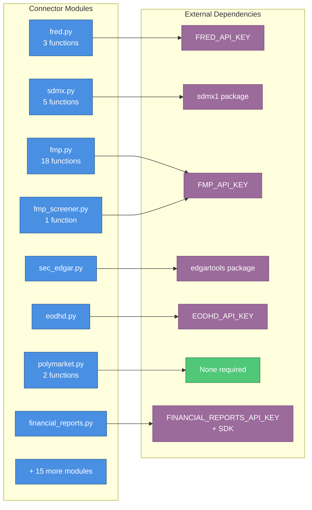

# parsimony API Reference

**Version**: 0.1.0  
**License**: Apache-2.0  
**Python**: 3.11 – 3.12

This reference covers every public symbol exported by `parsimony`, all 33 connector functions across 9 data-source modules, the catalog API, the factory functions, and all public types.

---

## Table of Contents

1. [Core Connector Framework](#core-connector-framework)
2. [Schema and Output Types](#schema-and-output-types)
3. [Catalog API](#catalog-api)
4. [Data Store API](#data-store-api)
5. [In-Memory Implementations](#in-memory-implementations)
6. [Embedding Providers](#embedding-providers)
7. [Utility Functions](#utility-functions)
8. [Factory Functions](#factory-functions)
9. [Connector Inventory](#connector-inventory)
   - [FRED Connectors](#fred-connectors)
   - [SDMX Connectors](#sdmx-connectors)
   - [FMP Connectors](#fmp-connectors)
   - [FMP Screener Connector](#fmp-screener-connector)
   - [SEC Edgar Connector](#sec-edgar-connector)
   - [EODHD Connector](#eodhd-connector)
   - [Polymarket Connectors](#polymarket-connectors)
   - [Financial Reports Connector](#financial-reports-connector)

---

## Core Connector Framework

Import from `parsimony`:

```python
from parsimony import Connector, Connectors, connector, enumerator, loader
```

### `Connector`

A frozen dataclass wrapping a single async data-fetching function.

```python
@dataclass(frozen=True)
class Connector:
    name: str
    description: str
    tags: frozenset[str]
    param_type: type[BaseModel]
    dep_names: frozenset[str]
    optional_dep_names: frozenset[str]
    fn: Callable
    output_config: OutputConfig | None
    callbacks: tuple[ResultCallback, ...]
```

**Methods**:

| Method | Signature | Description |
|--------|-----------|-------------|
| `__call__` | `async (params_dict_or_model, **kwargs) -> Result` | Validate params, inject deps, call fn, fire callbacks |
| `bind_deps` | `(self, **deps) -> Connector` | Return new `Connector` with dependencies pre-bound; returns self if no matching dep_names |
| `with_callback` | `(self, cb: ResultCallback) -> Connector` | Return new `Connector` with callback appended |
| `to_llm` | `(self) -> str` | Serialize connector as a plain-text tool description for LLM prompts |
| `describe` | `(self) -> str` | Return a short human-readable description |

**Notes**:
- All mutation methods return a **new** `Connector` instance; the original is not modified.
- `dep_names` are required keyword-only function arguments that must be bound before the connector is callable. `optional_dep_names` may be absent at call time.
- Params are validated via Pydantic v2 at every `__call__` invocation.

### `Connectors`

An immutable ordered collection of `Connector` instances.

```python
from parsimony import Connectors
```

**Constructor**: `Connectors(connectors: Sequence[Connector])`

**Methods**:

| Method | Signature | Description |
|--------|-----------|-------------|
| `__add__` | `(self, other: Connectors) -> Connectors` | Combine two bundles; returns new `Connectors` |
| `filter` | `(self, tags: Iterable[str]) -> Connectors` | Return new bundle containing only connectors whose tags intersect the given set |
| `bind_deps` | `(self, **deps) -> Connectors` | Apply `bind_deps` to every connector; returns new `Connectors` |
| `with_callback` | `(self, cb: ResultCallback) -> Connectors` | Apply `with_callback` to every connector; returns new `Connectors` |
| `to_llm` | `(self) -> str` | Concatenate all connector tool descriptions into one prompt block |
| `describe` | `(self) -> str` | Multi-line summary of all connectors |
| `__iter__` | `(self) -> Iterator[Connector]` | Iterate over contained connectors |
| `__len__` | `(self) -> int` | Number of connectors |
| `__getitem__` | `(self, name: str) -> Connector` | Look up a connector by name |

### `connector` decorator

```python
from parsimony import connector

connector(
    name: str | None = None,
    description: str | None = None,
    tags: list[str] | None = None,
    output: OutputConfig | None = None,
) -> Callable[[AsyncFunc], Connector]
```

Decorator factory for **general-purpose** connectors. The decorated function must be `async def` and accept a single Pydantic `BaseModel` as its first positional argument.

- `name`: overrides the function name as the connector's identifier.
- `description`: overrides the docstring as the connector's description.
- `tags`: list of string tags for filtering via `Connectors.filter()`.
- `output`: if provided, the return value is wrapped in `SemanticTableResult`; otherwise wrapped in `Result`.

**Schema contract**: no restrictions on `ColumnRole` usage.

### `enumerator` decorator

```python
from parsimony import enumerator

enumerator(output: OutputConfig) -> Callable[[AsyncFunc], Connector]
```

Decorator for **catalog-population** connectors. Enforces that the `OutputConfig` contains exactly one KEY column and at least one TITLE column. DATA columns are not permitted.

Use `enumerator` for functions that list series identifiers for later catalog ingestion.

### `loader` decorator

```python
from parsimony import loader

loader(output: OutputConfig) -> Callable[[AsyncFunc], Connector]
```

Decorator for **observation-loading** connectors. Enforces that the `OutputConfig` contains at least one KEY column and at least one DATA column. TITLE and METADATA columns are not permitted.

Use `loader` for functions that fetch time-series observations for a specific identifier.

### `ResultCallback`

```python
ResultCallback = Callable[[Result], Awaitable[None] | None]
```

Type alias for callbacks attached via `Connector.with_callback()`. Callbacks receive the `Result` after a connector call completes. They may be sync or async.

---

## Schema and Output Types

```python
from parsimony import (
    Namespace, Column, ColumnRole, OutputConfig,
    Provenance, Result, SemanticTableResult,
)
```

### `Namespace`

```python
Namespace(name: str)
```

Pydantic field metadata annotation that links a param model field to a catalog namespace. Used with `Annotated`:

```python
from typing import Annotated
from parsimony import Namespace

class FredFetchParams(BaseModel):
    series_id: Annotated[str, Namespace("fred")]
```

A connector whose param model has a `Namespace`-annotated field supports automatic `(namespace, code)` identity extraction for catalog indexing.

### `ColumnRole`

```python
from parsimony import ColumnRole

class ColumnRole(str, Enum):
    KEY      = "key"       # Series identifier (namespace + code)
    DATA     = "data"      # Numeric observation values
    TITLE    = "title"     # Human-readable label
    METADATA = "metadata"  # Ancillary context; excluded from data analysis
```

### `Column`

```python
Column(
    name: str,
    role: ColumnRole,
    dtype: str,
    mapped_name: str | None = None,
    param_key: str | None = None,
    description: str | None = None,
    exclude_from_llm_view: bool = False,
    namespace: str | None = None,
)
```

Describes a single column in a connector's output DataFrame. Applied via `OutputConfig`.

- `name`: column name in the output DataFrame.
- `role`: semantic role of the column.
- `mapped_name`: optional alias used when the raw API response column has a different name.
- `param_key`: links this column back to a param field (used in KEY columns).
- `namespace`: namespace string for KEY columns; enables catalog identity resolution.

### `OutputConfig`

```python
OutputConfig(columns: list[Column])
```

Declares the full schema for a connector's output. Passed to the `output` argument of `@connector()`, `@enumerator()`, or `@loader()`. When an `OutputConfig` is present, the connector returns `SemanticTableResult`; otherwise it returns `Result`.

### `Provenance`

```python
Provenance(
    source: str,
    source_description: str | None = None,
    params: dict,
    fetched_at: datetime,
    title: str | None = None,
    properties: dict | None = None,
)
```

Immutable data lineage record attached to every `Result`. `params` holds the serialized Pydantic params model; keyword-only dependency arguments (API keys) are never included.

### `Result`

```python
Result(
    data: pd.DataFrame,
    provenance: Provenance,
    output_schema: OutputConfig | None = None,
)
```

Base result type returned by any connector.

**Class methods**:

| Method | Signature | Description |
|--------|-----------|-------------|
| `from_dataframe` | `(df, provenance) -> Result` | Wrap a raw DataFrame |
| `from_arrow` | `(table: pa.Table) -> Result` | Deserialize from Arrow table |
| `from_parquet` | `(path: str \| Path) -> Result` | Deserialize from Parquet file |

**Instance methods**:

| Method | Signature | Description |
|--------|-----------|-------------|
| `to_table` | `(output_config: OutputConfig) -> SemanticTableResult` | Promote to `SemanticTableResult` with the given schema |
| `to_arrow` | `() -> pa.Table` | Serialize to Arrow table (schema stored in metadata) |
| `to_parquet` | `(path: str \| Path) -> None` | Write to Parquet file |

### `SemanticTableResult`

```python
SemanticTableResult(
    data: pd.DataFrame,
    provenance: Provenance,
    output_schema: OutputConfig,   # required (not optional)
)
```

Subclass of `Result` with a required `OutputConfig`. Produced by connectors decorated with an `output=` argument, or by calling `result.to_table(config)`.

**Properties**:

| Property | Type | Description |
|----------|------|-------------|
| `entity_keys` | `pd.DataFrame` | DataFrame subset containing KEY columns |
| `data_columns` | `list[Column]` | Columns with `role == DATA` |
| `metadata_columns` | `list[Column]` | Columns with `role == METADATA` |

All `Result` serialization methods (`to_arrow`, `to_parquet`, `from_arrow`, `from_parquet`) are inherited and work with the full schema.

---

## Catalog API

```python
from parsimony import (
    BaseCatalog, Catalog, EmbedderInfo,
    SeriesEntry, SeriesMatch, IndexResult,
)
```

### `BaseCatalog`

Abstract base class for all catalogs. Implementations own both the storage layout *and* the embedder, because index-time and query-time embeddings must come from the same model.

**Abstract methods** (override in subclasses):

| Method | Signature | Description |
|--------|-----------|-------------|
| `upsert` | `async (entries: list[SeriesEntry]) -> None` | Insert or update entries; the catalog computes embeddings as needed |
| `get` | `async (namespace: str, code: str) -> SeriesEntry \| None` | Retrieve a single entry |
| `delete` | `async (namespace: str, code: str) -> None` | Remove an entry |
| `exists` | `async (keys: list[tuple[str, str]]) -> set[tuple[str, str]]` | Subset of keys that already exist |
| `search` | `async (query: str, limit: int, *, namespaces: list[str] \| None = None) -> list[SeriesMatch]` | Hybrid retrieval; ranking strategy is up to the implementation |
| `list` | `async (*, namespace=None, q=None, limit=50, offset=0) -> tuple[list[SeriesEntry], int]` | Paginated browse; returns `(entries, total)` |
| `list_namespaces` | `async () -> list[str]` | Distinct namespaces, sorted |

**Concrete orchestration** (inherited):

| Method | Description |
|--------|-------------|
| `index_result(table, *, batch_size=100, extra_tags=None, dry_run=False, force=False)` | Extract `SeriesEntry` rows from a `SemanticTableResult` and `ingest` them |
| `ingest(entries, *, batch_size=100, dry_run=False, force=False)` | Dedupe and upsert in batches; returns an `IndexResult` |
| `embedder_info` (property) | Identity of the embedder, if any (override in subclasses that own one) |
| `from_url(url)` (classmethod) | Default raises `NotImplementedError`; the standard `Catalog` overrides this |
| `push(url)` | Default raises `NotImplementedError`; the standard `Catalog` overrides this |

> **Warning**: `force=True` bypasses dedupe. Use only for bulk re-indexing where the caller guarantees idempotency.

### `Catalog` (the standard implementation)

```python
from parsimony import Catalog, SentenceTransformerEmbedder, LiteLLMEmbeddingProvider

catalog = Catalog("fred")                                                   # default: BAAI/bge-small-en-v1.5
catalog = Catalog("fred", embedder=SentenceTransformerEmbedder("..."))      # different local model
catalog = Catalog("fred", embedder=LiteLLMEmbeddingProvider(                # hosted-API embedder
    model="openai/text-embedding-3-small",
    dimension=1536,
))
```

Every `Catalog` requires a `name` (lowercase snake_case). The name is the catalog's identity: it is persisted in `meta.json`, conventionally matches the HF dataset repo suffix (e.g. `"fred"` for `hf://ockham/catalog-fred`), and is round-tripped by `Catalog.load` / `Catalog.from_url`. A catalog is to `SeriesEntry` what `Connectors` is to `Connector` — a named collection. Two catalogs are combined by upsert (`await big.upsert(small.entries)` or, equivalently, `await big.extend(small)`).

`parsimony.Catalog` is the canonical `BaseCatalog`: Parquet rows + FAISS vectors + BM25 keywords + Reciprocal Rank Fusion. Requires `pip install 'parsimony-core[standard]'` (and `parsimony-core[litellm]` for the hosted embedder) and is loaded lazily on first access so `import parsimony` stays cheap.

Adds these methods on top of the ABC:

| Method | Description |
|--------|-------------|
| `save(path, *, builder=None)` | Atomically write the three-file directory snapshot (`meta.json`, `entries.parquet`, `embeddings.faiss`) to *path* |
| `load(path, *, embedder=None)` (classmethod) | Read a snapshot from *path*; the embedder must match the snapshot's recorded `dim` and `normalize` |
| `from_url(url)` (classmethod) | Load a snapshot via URL scheme: `file://`, `hf://`, `s3://` (planned) |
| `push(url)` | Publish via URL scheme |

The embedder is owned by the catalog; there is no separate `embeddings=` parameter on search. Hybrid retrieval is the only mode.

### `SeriesEntry`

```python
SeriesEntry(
    namespace: str,
    code: str,
    title: str,
    tags: list[str] = [],
    description: str | None = None,
    metadata: dict = {},
    embedding: list[float] | None = None,
)
```

A catalog record representing a discoverable data series. Use `entry.embedding_text()` to compose the text the catalog should index/query for this entry (default: title + metadata + tags joined with `" | "`).

### `SeriesMatch`

```python
SeriesMatch(
    namespace: str,
    code: str,
    title: str,
    similarity: float,
    tags: list[str] = [],
    description: str | None = None,
    metadata: dict = {},
)
```

A search result returned by `Catalog.search()`. `similarity` is the fused RRF score; higher is more relevant.

### `IndexResult`

```python
IndexResult(
    total: int,
    indexed: int,
    skipped: int,
    errors: int,
)
```

Summary returned by `index_result()` and `ingest()`.

### `EmbedderInfo`

```python
EmbedderInfo(
    model: str,
    dim: int,
    normalize: bool = True,
    package: str | None = None,
)
```

Persisted identity of the embedder a catalog uses. Written into `meta.json` by `Catalog.save` and validated by `Catalog.load`. `package` is an optional install hint (e.g. `"parsimony-core[standard]"`) surfaced in error messages.

---

## Data Store API

```python
from parsimony import DataStore, LoadResult
```

### `DataStore`

Abstract base class for observation (DataFrame) persistence backends.

**Abstract methods**:

| Method | Signature | Description |
|--------|-----------|-------------|
| `upsert` | `async (namespace: str, code: str, result: Result) -> None` | Store or replace a result |
| `get` | `async (namespace: str, code: str) -> Result \| None` | Retrieve a stored result |
| `delete` | `async (namespace: str, code: str) -> None` | Remove a stored result |
| `exists` | `async (namespace: str, code: str) -> bool` | Check existence |
| `load_result` | `async (entries: list[SeriesEntry], connector: Connector) -> LoadResult` | Fetch and store observations for a list of catalog entries using the given connector |

### `LoadResult`

```python
LoadResult(
    total: int,
    loaded: int,
    skipped: int,
    errors: int,
)
```

Summary returned by `DataStore.load_result()`.

---

## In-Memory Implementations

```python
from parsimony import InMemoryDataStore
```

### `InMemoryDataStore`

Dict-backed implementation of `DataStore`. Suitable for development and testing.

```python
data_store = InMemoryDataStore()
```

---

## Embedders

Two implementations of the embedder contract ship with the standard catalog. Both are exposed at the top level and lazy-loaded.

```python
from parsimony import EmbeddingProvider, SentenceTransformerEmbedder, LiteLLMEmbeddingProvider
```

### `SentenceTransformerEmbedder`

```python
SentenceTransformerEmbedder(
    *,
    model: str = "BAAI/bge-small-en-v1.5",
    normalize: bool = True,
    device: str | None = None,
    batch_size: int = 64,
)
```

Local embedder backed by `sentence-transformers`. Default model is `BAAI/bge-small-en-v1.5` (384 dim). Requires `parsimony-core[standard]`.

### `LiteLLMEmbeddingProvider`

```python
LiteLLMEmbeddingProvider(
    *,
    model: str,
    dimension: int,
    batch_size: int = 100,
)
```

Hosted-API embedder backed by [litellm](https://github.com/BerriAI/litellm). Use `model` strings like `"openai/text-embedding-3-small"`, `"gemini/text-embedding-004"`, `"cohere/embed-english-v3.0"`, `"voyage/voyage-3"`, or any other litellm-supported provider; `dimension` must match what the API returns. Outputs are L2-normalized so they round-trip cleanly with the FAISS inner-product index. Requires `parsimony-core[litellm]` and the relevant provider credentials in the environment.

### `EmbeddingProvider`

The contract every embedder satisfies. Subclass it to plug in a custom backend:

| Member | Description |
|--------|-------------|
| `async embed_texts(texts: list[str]) -> list[list[float]]` | Embed a batch of corpus documents |
| `async embed_query(query: str) -> list[float]` | Embed a single query |
| `dimension: int` (property) | Output vector dimension |
| `info() -> EmbedderInfo` | Identity persisted into `meta.json` |

---

## Utility Functions

```python
from parsimony import (
    code_token,
    normalize_code,
    series_match_from_entry,
)
```

| Function | Signature | Description |
|----------|-----------|-------------|
| `code_token` | `(code: str) -> str` | Normalize a code string to a single slug token (removes separators) |
| `normalize_code` | `(code: str) -> str` | Lowercase normalization of namespace/code identifiers |
| `series_match_from_entry` | `(entry: SeriesEntry, similarity: float) -> SeriesMatch` | Construct a `SeriesMatch` from an existing `SeriesEntry` |

`SeriesEntry.embedding_text()` (instance method) composes the text the standard catalog indexes/queries for an entry.

---

## Factory Functions

These functions are not in `__all__` but are the primary entry points for production use. Import from `parsimony.connectors`.

```python
from parsimony.connectors import build_connectors_from_env
```

### `build_connectors_from_env`

```python
build_connectors_from_env(*, env: dict[str, str] | None = None, lenient: bool = False) -> Connectors
```

Single factory that builds the complete `Connectors` bundle — all providers registered in the `PROVIDERS` registry — with API keys injected from environment variables.

- `env`: optional dict of environment variables; defaults to `os.environ` if `None`.
- `lenient`: when `True`, skips required providers whose env vars are missing (used by the catalog builder). When `False` (default), missing required env vars raise an error.

**Required env vars**: `FRED_API_KEY`  
**Optional env vars**: `FMP_API_KEY`, `EODHD_API_KEY`, `FINNHUB_API_KEY`, `TIINGO_API_KEY`, `COINGECKO_API_KEY`, `EIA_API_KEY`, `ALPHA_VANTAGE_API_KEY`, `FINANCIAL_REPORTS_API_KEY`, and others

Connectors whose optional env var is absent are silently excluded from the returned bundle.

To get only the interactive agent tools (search, discovery, reference lookups), filter the result:

```python
tools = connectors.filter(tags=["tool"])
```

---

## Connector Inventory

All 33 connector functions are listed below. Each connector is `async` and accepts a Pydantic params model as its first argument. Unless otherwise noted, connectors return `SemanticTableResult` (when `output=` is set) or `Result`.

The diagram below shows how the 33 functions are distributed across the 9 connector modules and which external dependency each module requires.



### FRED Connectors

**Module**: `parsimony.connectors.fred`  
**Required dependency**: `FRED_API_KEY` environment variable

#### `fred_search`

| Field | Value |
|-------|-------|
| Tags | `["macro"]` |
| Decorator | `@connector` |
| Required env | `FRED_API_KEY` |

**Params model** (`FredSearchParams`):

| Parameter | Type | Description |
|-----------|------|-------------|
| `query` | `str` | Search text for FRED series |
| `limit` | `int` | Maximum results to return |

Search FRED for macroeconomic series matching a text query. Returns a DataFrame of matching series identifiers and titles.

#### `fred`

| Field | Value |
|-------|-------|
| Tags | `["macro"]` |
| Decorator | `@loader` |
| Required env | `FRED_API_KEY` |

**Params model** (`FredFetchParams`):

| Parameter | Type | Description |
|-----------|------|-------------|
| `series_id` | `Annotated[str, Namespace("fred")]` | FRED series identifier (e.g. `"GDP"`) |
| `observation_start` | `str \| None` | Start date in `YYYY-MM-DD` format |
| `observation_end` | `str \| None` | End date in `YYYY-MM-DD` format |

Fetch time-series observations for a FRED series. Returns a `SemanticTableResult` with KEY and DATA columns.

#### `enumerate_fred_release`

| Field | Value |
|-------|-------|
| Tags | `["fred"]` |
| Decorator | `@enumerator` |
| Required env | `FRED_API_KEY` |

**Params model** (`FredReleaseParams`):

| Parameter | Type | Description |
|-----------|------|-------------|
| `release_id` | `int` | FRED release identifier |

Enumerate all series in a FRED release. Returns a `SemanticTableResult` with KEY and TITLE columns. Suitable for bulk catalog indexing.

---

### SDMX Connectors

**Module**: `parsimony.connectors.sdmx`  
**Required dependency**: `sdmx1` package (included in base install)  
**No API key required**

#### `sdmx`

| Field | Value |
|-------|-------|
| Tags | `["sdmx"]` |
| Decorator | `@loader` |

**Params model** (`SdmxFetchParams`):

| Parameter | Type | Description |
|-----------|------|-------------|
| `provider` | `str` | SDMX provider ID (e.g. `"ECB"`, `"IMF"`, `"ESTAT"`) |
| `dataset_id` | `str` | Dataset identifier within the provider |
| `key` | `str \| None` | SDMX dimension key filter (e.g. `"A.DE...."`) |
| `start_period` | `str \| None` | Start period (e.g. `"2000"`, `"2000-Q1"`) |
| `end_period` | `str \| None` | End period |

Fetch observations for an SDMX dataset from any supported provider.

#### `sdmx_list_datasets`

| Field | Value |
|-------|-------|
| Tags | `["sdmx"]` |
| Decorator | `@connector` |

**Params model** (`SdmxListDatasetsParams`):

| Parameter | Type | Description |
|-----------|------|-------------|
| `provider` | `str` | SDMX provider ID |

List all available datasets from an SDMX provider.

#### `sdmx_dsd`

| Field | Value |
|-------|-------|
| Tags | `["sdmx"]` |
| Decorator | `@connector` |

**Params model** (`SdmxDsdParams`):

| Parameter | Type | Description |
|-----------|------|-------------|
| `provider` | `str` | SDMX provider ID |
| `dataset_id` | `str` | Dataset identifier |

Retrieve the Data Structure Definition (DSD) for an SDMX dataset. Describes dimensions, attributes, and codelists.

#### `sdmx_codelist`

| Field | Value |
|-------|-------|
| Tags | `["sdmx"]` |
| Decorator | `@connector` |

**Params model** (`SdmxCodelistParams`):

| Parameter | Type | Description |
|-----------|------|-------------|
| `provider` | `str` | SDMX provider ID |
| `codelist_id` | `str` | Codelist identifier |

Retrieve a single SDMX codelist. Returns a DataFrame of codes and their labels.

#### `sdmx_series_keys`

| Field | Value |
|-------|-------|
| Tags | `["sdmx"]` |
| Decorator | `@enumerator` |

**Params model** (`SdmxSeriesKeysParams`):

| Parameter | Type | Description |
|-----------|------|-------------|
| `provider` | `str` | SDMX provider ID |
| `dataset_id` | `Annotated[str, Namespace("sdmx")]` | Dataset identifier |

Enumerate all series keys in an SDMX dataset. Returns KEY and TITLE columns. Suitable for bulk catalog indexing.

> **Note**: `enumerate_sdmx_dataset_codelists()` is a non-connector helper function in `sdmx.py` that returns `list[SemanticTableResult]` but is not registered as a `Connector`. It is not part of the standard calling convention.

---

### FMP Connectors

**Module**: `parsimony.connectors.fmp`  
**Required dependency**: `FMP_API_KEY` environment variable

All FMP connectors share the tag `["equity"]` unless otherwise noted. Utility connectors have the additional tag `"utility"`.

#### `fmp_search`

| Tags | `["equity", "utility"]` | Decorator | `@connector` |
|------|-------------------------|-----------|--------------|

**Params** (`FmpSearchParams`): `query: str`, `limit: int`

Search FMP for companies and securities matching a text query.

#### `fmp_taxonomy`

| Tags | `["equity", "utility"]` | Decorator | `@connector` |
|------|-------------------------|-----------|--------------|

**Params** (`FmpTaxonomyParams`): `exchange: str | None`, `sector: str | None`, `industry: str | None`

Retrieve the FMP taxonomy of exchanges, sectors, and industries.

#### `fmp_quotes`

| Tags | `["equity"]` | Decorator | `@loader` |
|------|--------------|-----------|-----------|

**Params** (`FmpQuotesParams`): `symbol: Annotated[str, Namespace("fmp")]`

Fetch the latest quote (price, volume, change) for a single ticker symbol.

#### `fmp_prices`

| Tags | `["equity"]` | Decorator | `@loader` |
|------|--------------|-----------|-----------|

**Params** (`FmpPricesParams`): `symbol: Annotated[str, Namespace("fmp")]`, `from_date: str | None`, `to_date: str | None`

Fetch historical daily price data for a ticker symbol.

#### `fmp_company_profile`

| Tags | `["equity"]` | Decorator | `@connector` |
|------|--------------|-----------|--------------|

**Params** (`FmpCompanyProfileParams`): `symbol: Annotated[str, Namespace("fmp")]`

Fetch company profile (name, description, sector, country, market cap, etc.) for a ticker symbol.

#### `fmp_peers`

| Tags | `["equity"]` | Decorator | `@connector` |
|------|--------------|-----------|--------------|

**Params** (`FmpPeersParams`): `symbol: Annotated[str, Namespace("fmp")]`

Fetch a list of peer companies for a ticker symbol.

#### `fmp_income_statements`

| Tags | `["equity"]` | Decorator | `@loader` |
|------|--------------|-----------|-----------|

**Params** (`FmpIncomeStatementsParams`): `symbol: Annotated[str, Namespace("fmp")]`, `period: str` (`"annual"` or `"quarter"`), `limit: int`

Fetch historical income statements for a ticker symbol.

#### `fmp_balance_sheet_statements`

| Tags | `["equity"]` | Decorator | `@loader` |
|------|--------------|-----------|-----------|

**Params** (`FmpBalanceSheetStatementsParams`): `symbol: Annotated[str, Namespace("fmp")]`, `period: str`, `limit: int`

Fetch historical balance sheet statements for a ticker symbol.

#### `fmp_cash_flow_statements`

| Tags | `["equity"]` | Decorator | `@loader` |
|------|--------------|-----------|-----------|

**Params** (`FmpCashFlowStatementsParams`): `symbol: Annotated[str, Namespace("fmp")]`, `period: str`, `limit: int`

Fetch historical cash flow statements for a ticker symbol.

#### `fmp_corporate_history`

| Tags | `["equity"]` | Decorator | `@connector` |
|------|--------------|-----------|--------------|

**Params** (`FmpCorporateHistoryParams`): `symbol: Annotated[str, Namespace("fmp")]`

Fetch corporate history events (splits, dividends, name changes) for a ticker symbol.

#### `fmp_event_calendar`

| Tags | `["equity"]` | Decorator | `@connector` |
|------|--------------|-----------|--------------|

**Params** (`FmpEventCalendarParams`): `from_date: str | None`, `to_date: str | None`

Fetch the earnings event calendar for a date range.

#### `fmp_analyst_estimates`

| Tags | `["equity"]` | Decorator | `@loader` |
|------|--------------|-----------|-----------|

**Params** (`FmpAnalystEstimatesParams`): `symbol: Annotated[str, Namespace("fmp")]`, `period: str`, `limit: int`

Fetch analyst consensus estimates for a ticker symbol.

#### `fmp_news`

| Tags | `["equity"]` | Decorator | `@connector` |
|------|--------------|-----------|--------------|

**Params** (`FmpNewsParams`): `tickers: list[str]`, `limit: int`

Fetch recent news articles for one or more ticker symbols.

#### `fmp_insider_trades`

| Tags | `["equity"]` | Decorator | `@connector` |
|------|--------------|-----------|--------------|

**Params** (`FmpInsiderTradesParams`): `symbol: Annotated[str, Namespace("fmp")]`, `limit: int`

Fetch insider transaction filings for a ticker symbol.

#### `fmp_institutional_positions`

| Tags | `["equity"]` | Decorator | `@connector` |
|------|--------------|-----------|--------------|

**Params** (`FmpInstitutionalPositionsParams`): `symbol: Annotated[str, Namespace("fmp")]`, `limit: int`

Fetch institutional ownership positions for a ticker symbol (13F filings).

#### `fmp_earnings_transcript`

| Tags | `["equity"]` | Decorator | `@connector` |
|------|--------------|-----------|--------------|

**Params** (`FmpEarningsTranscriptParams`): `symbol: Annotated[str, Namespace("fmp")]`, `year: int`, `quarter: int`

Fetch earnings call transcript text for a ticker symbol, year, and quarter.

#### `fmp_index_constituents`

| Tags | `["equity"]` | Decorator | `@enumerator` |
|------|--------------|-----------|---------------|

**Params** (`FmpIndexConstituentsParams`): `index: Annotated[str, Namespace("fmp_index")]`

Enumerate the constituent symbols of a market index (e.g. `"sp500"`, `"nasdaq100"`). Returns KEY and TITLE columns.

#### `fmp_market_movers`

| Tags | `["equity"]` | Decorator | `@connector` |
|------|--------------|-----------|--------------|

**Params** (`FmpMarketMoversParams`): `direction: str` (`"gainers"` or `"losers"`), `limit: int`

Fetch the top market movers (largest price changers) for the current session.

---

### FMP Screener Connector

**Module**: `parsimony.connectors.fmp_screener`  
**Required dependency**: `FMP_API_KEY`

#### `fmp_screener`

| Field | Value |
|-------|-------|
| Tags | `["equity"]` |
| Decorator | `@connector` |
| Required env | `FMP_API_KEY` |

**Params model** (`FmpScreenerParams`):

| Parameter | Type | Description |
|-----------|------|-------------|
| `market_cap_more_than` | `int \| None` | Minimum market cap filter |
| `market_cap_lower_than` | `int \| None` | Maximum market cap filter |
| `sector` | `str \| None` | Sector name filter |
| `industry` | `str \| None` | Industry name filter |
| `exchange` | `str \| None` | Exchange filter |
| `country` | `str \| None` | Country filter |
| `is_etf` | `bool \| None` | Filter for ETFs |
| `is_actively_trading` | `bool \| None` | Filter for actively trading securities |
| `limit` | `int` | Maximum results |
| `where_clause` | `str \| None` | pandas query string applied after merging results |

Screens companies using FMP's screener endpoint, then concurrently fetches key metrics and financial ratios for each result. Merges all three data sources by symbol. Concurrent API calls are rate-limited internally by a semaphore (`_SEMAPHORE_LIMIT = 10`).

> **Security note**: `where_clause` is passed directly to `DataFrame.query()`. Do not expose this parameter to untrusted user input.

---

### SEC Edgar Connector

**Module**: `parsimony_edgar` (install: `pip install parsimony-edgar`)  
**Required dependency**: `edgartools` (pulled in automatically)  
**No API key required** (optional `SEC_EDGAR_USER_AGENT` / `EDGAR_IDENTITY` for request identification)

#### `sec_edgar_fetch`

| Field | Value |
|-------|-------|
| Tags | `["sec_edgar"]` |
| Decorator | `@connector` |
| Required env | None (optional: `SEC_EDGAR_USER_AGENT` or `EDGAR_IDENTITY`) |

**Params model** (`SecEdgarFetchParams`):

| Parameter | Type | Description |
|-----------|------|-------------|
| `ticker` | `str` | Company ticker symbol |
| `form_type` | `str` | SEC form type (e.g. `"10-K"`, `"10-Q"`, `"8-K"`) |
| `limit` | `int` | Maximum filings to return |

Fetch SEC Edgar filings for a company. Uses the `edgartools` synchronous library wrapped in an async dispatch class.

---

### EODHD Connector

**Module**: `parsimony.connectors.eodhd`  
**Required dependency**: `EODHD_API_KEY` environment variable

#### `eodhd_fetch`

| Field | Value |
|-------|-------|
| Tags | `["eodhd"]` |
| Decorator | `@loader` |
| Required env | `EODHD_API_KEY` |

**Params model** (`EodhdFetchParams`):

| Parameter | Type | Description |
|-----------|------|-------------|
| `symbol` | `Annotated[str, Namespace("eodhd")]` | EODHD ticker symbol (e.g. `"AAPL.US"`) |
| `from_date` | `str \| None` | Start date (`YYYY-MM-DD`) |
| `to_date` | `str \| None` | End date (`YYYY-MM-DD`) |
| `period` | `str` | Bar period: `"d"` (daily), `"w"` (weekly), `"m"` (monthly) |

Fetch historical end-of-day price data from EODHD.

---

### Polymarket Connectors

**Module**: `parsimony.connectors.polymarket`  
**No API key or additional dependencies required**

#### `polymarket_gamma`

| Field | Value |
|-------|-------|
| Tags | `["polymarket"]` |
| Decorator | `@connector` |

**Params model** (`PolymarketGammaFetchParams`):

| Parameter | Type | Description |
|-----------|------|-------------|
| `market_id` | `str \| None` | Polymarket market ID |
| `query` | `str \| None` | Text search query |
| `limit` | `int` | Maximum results |

Fetch prediction market data from Polymarket's Gamma API.

#### `polymarket_clob`

| Field | Value |
|-------|-------|
| Tags | `["polymarket"]` |
| Decorator | `@connector` |

**Params model** (`PolymarketClobFetchParams`):

| Parameter | Type | Description |
|-----------|------|-------------|
| `token_id` | `str` | Polymarket CLOB token ID |

Fetch order book and trade data from Polymarket's Central Limit Order Book (CLOB) API.

---

### Financial Reports Connector

**Module**: `parsimony_financial_reports` (install: `pip install parsimony-financial-reports`)  
**Required dependencies**: `FINANCIAL_REPORTS_API_KEY` environment variable + `financial-reports-generated-client` SDK (pulled in automatically)

#### `financial_reports_fetch`

| Field | Value |
|-------|-------|
| Tags | `["financial_reports"]` |
| Decorator | `@connector` |
| Required env | `FINANCIAL_REPORTS_API_KEY` |

**Params model** (`FinancialReportsFetchParams`):

| Parameter | Type | Description |
|-----------|------|-------------|
| `report_type` | `str` | Report type identifier (maps to a specific SDK client method) |
| `symbol` | `str \| None` | Ticker symbol (where applicable) |
| `year` | `int \| None` | Report year (where applicable) |

Fetch financial reports using the `financial-reports-generated-client` SDK. Supports up to 20 distinct report types dispatched via an internal if/elif chain.
