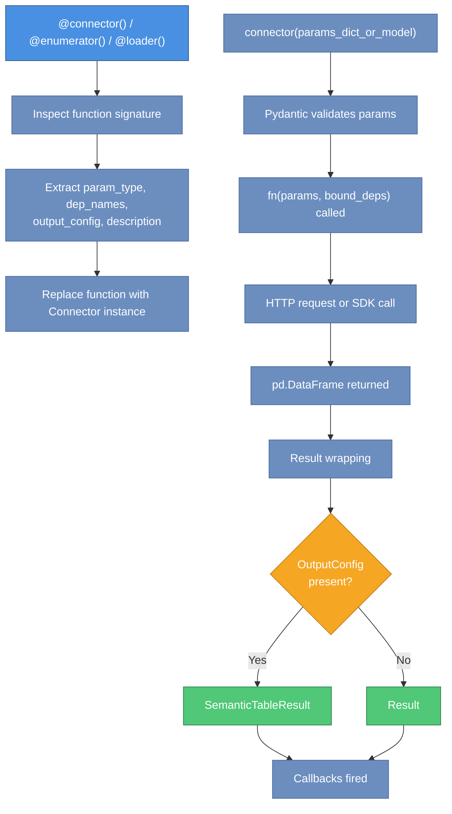
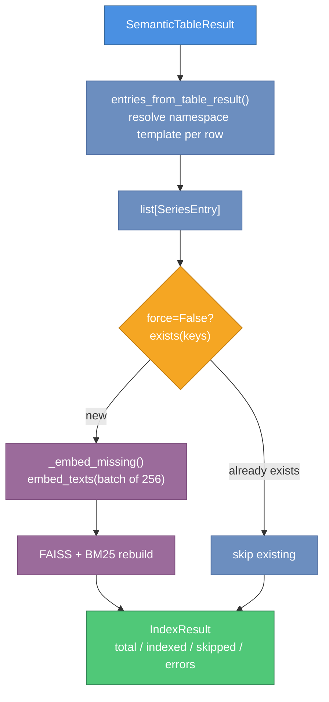

# parsimony Architecture

**Version**: 0.1.0  
**Audience**: Contributors, integrators, and developers who need to extend the library

This document describes the internal design of parsimony: the connector pattern and its three decorator variants, the catalog abstraction, the HTTP transport layer, the typed error hierarchy, and how the 24 connector modules are organized and composed.

---

## Table of Contents

1. [Design Philosophy](#design-philosophy)
2. [Module Organization](#module-organization)
3. [The Connector Pattern](#the-connector-pattern)
4. [Decorator Variants and Schema Contracts](#decorator-variants-and-schema-contracts)
5. [Dependency Injection Flow](#dependency-injection-flow)
6. [Result and Schema Layer](#result-and-schema-layer)
7. [Catalog Subsystem](#catalog-subsystem)
8. [HTTP Transport Layer](#http-transport-layer)
9. [Error Hierarchy](#error-hierarchy)
10. [Connector Implementations: 24 Modules](#connector-implementations-24-modules)
11. [Connector Composition and Injection](#connector-composition-and-injection)
12. [Data Flow Diagrams](#data-flow-diagrams)
13. [Dependency Graph](#dependency-graph)
14. [Key Design Decisions](#key-design-decisions)

---

## Design Philosophy

parsimony is built around three core principles:

**Uniform interface**. Every data source — whether it is FRED's REST API, an SDMX provider, or a central bank endpoint — exposes the same calling convention: an async function that accepts a Pydantic model and returns a typed DataFrame wrapped in a `Result`.

**Immutability**. The `Connector` and `Connectors` types are frozen dataclasses. Every operation that would modify them — binding dependencies, attaching callbacks, filtering — returns a new instance. The original is never mutated.

**Pluggable backends**. The catalog and data store are defined as abstract base classes (`BaseCatalog`, `DataStore`). The standard `Catalog` (Parquet + FAISS + BM25 + RRF) ships under `parsimony-core[standard]`; custom backends (Postgres + pgvector, Redis, in-memory mocks) subclass `BaseCatalog` directly — there is no plugin axis for catalogs.

---

## Module Organization

```
parsimony/
├── __init__.py               # Public API surface (__all__)
├── connector.py              # Connector, Connectors, decorators
├── errors.py                 # Typed error hierarchy (ConnectorError and subclasses)
├── result.py                 # Result, SemanticTableResult, OutputConfig, Column, ColumnRole
├── catalog/
│   ├── catalog.py            # BaseCatalog ABC + entries_from_table_result
│   ├── models.py             # SeriesEntry, SeriesMatch, IndexResult, catalog_key helpers
│   └── embedder_info.py      # EmbedderInfo (persisted embedder identity)
├── _standard/                # Canonical Catalog implementation ([standard] extra)
│   ├── __init__.py           # Re-exports Catalog + embedders
│   ├── catalog.py            # Catalog(BaseCatalog): Parquet rows + FAISS + BM25 + RRF
│   ├── embedder.py           # EmbeddingProvider ABC, SentenceTransformerEmbedder, LiteLLMEmbeddingProvider
│   ├── indexes.py            # FAISS + BM25 helpers, whitespace tokenize(), rrf_fuse()
│   ├── meta.py               # CatalogMeta, BuildInfo, snapshot filename constants
│   └── sources/              # URL scheme dispatch for from_url/push
│       ├── __init__.py       # load_from_url / push_to_url
│       ├── local.py          # file://
│       ├── hf.py             # hf://  (huggingface_hub)
│       └── s3.py             # s3://  (planned)
├── bundles/
│   ├── __init__.py           # LazyNamespaceCatalog, CatalogSpec, CatalogPlan
│   ├── spec.py               # Declarative catalog plans (spec + discovery + build)
│   ├── discovery.py          # Walk connectors → CatalogSpec
│   ├── build.py              # Execute a CatalogPlan against a base Catalog
│   └── lazy_catalog.py       # LazyNamespaceCatalog wrapper (opt-in auto-populate)
├── stores/
│   ├── __init__.py           # Re-exports DataStore + InMemoryDataStore
│   ├── data_store.py         # DataStore ABC, LoadResult
│   └── memory_data.py        # InMemoryDataStore
├── discovery/                # Plugin entry-point discovery (parsimony.providers)
├── transport/
│   ├── http.py               # HttpClient wrapping httpx; API key log redaction
│   └── json_helpers.py       # json_to_df(), interpolate_path()
├── cli/                      # `parsimony {list-plugins,conformance,bundles}`
└── testing.py                # assert_plugin_valid + ProviderTestSuite (pytest)
```

The MCP server and every connector (FRED, SDMX, FMP, SEC Edgar, Polymarket, central banks, …) live in separate distributions — `parsimony-mcp`, `parsimony-fred`, `parsimony-sdmx`, etc. — and are discovered through the `parsimony.providers` entry-point group. The kernel ships no provider-specific code.

The dependency graph is a directed acyclic graph. The two most widely imported modules are `result.py` and `catalog/models.py`. No circular dependencies exist.

---

## The Connector Pattern

The central abstraction is the `Connector` frozen dataclass defined in `connector.py`.

```python
@dataclass(frozen=True)
class Connector:
    name: str
    description: str
    tags: frozenset[str]
    param_type: type[BaseModel]       # Pydantic model for params validation
    dep_names: frozenset[str]         # Required keyword-only deps (must be bound)
    optional_dep_names: frozenset[str]# Optional keyword-only deps (may be absent)
    fn: Callable                      # The wrapped async function (partial after bind_deps)
    output_config: OutputConfig | None
    callbacks: tuple[ResultCallback, ...]
```

The following diagram shows the complete execution flow from decorator application through to the returned result.



When a developer writes a connector function using the `@connector()` decorator, the decorator inspects the function signature to extract:

- `param_type`: the Pydantic `BaseModel` subclass that is the first positional parameter.
- `dep_names`: keyword-only parameters (after `*`) that have no default value and are not yet bound.
- `output_config`: taken from the `output=` argument to the decorator.
- `description`: from the function docstring.

The decorator replaces the function with a `Connector` instance. Calling the `Connector` with a params dict or model instance triggers Pydantic validation, calls the wrapped function, and wraps the return value in a `Result` or `SemanticTableResult`.

### Immutability pattern

All mutation operations on `Connector` return a new instance:

```python
# bind_deps returns a new Connector with fn replaced by a partial
bound = connector.bind_deps(api_key="secret")

# with_callback returns a new Connector with callbacks extended
logged = connector.with_callback(my_callback)

# Original connector is unchanged
assert connector.dep_names == frozenset({"api_key"})
assert bound.dep_names == frozenset()
```

`Connectors` follows the same pattern. The `+` operator, `.filter()`, `.bind_deps()`, and `.with_callback()` all return new `Connectors` instances.

---

## Decorator Variants and Schema Contracts

Three decorator factories are provided, each enforcing a different column-role contract on the `OutputConfig`.

| Decorator | KEY required | TITLE required | DATA allowed | METADATA allowed | Primary use case |
|-----------|:-----------:|:--------------:|:------------:|:----------------:|-----------------|
| `@connector()` | No | No | Yes | Yes | General search, profile, fetch |
| `@enumerator(output)` | Yes (with namespace) | Yes | No | Yes | Catalog population: list series IDs |
| `@loader(output)` | Yes (with namespace) | No | Yes | No | Observation loading: time series data |

The `output` parameter is mandatory for `@enumerator` and `@loader`; it is optional for `@connector`. When `output` is present, the connector automatically wraps its return value in a `SemanticTableResult` instead of a plain `Result`.

```python
# @enumerator enforces KEY + TITLE, no DATA
@enumerator(output=OutputConfig(columns=[
    Column(name="series_id", role=ColumnRole.KEY,   dtype="str", namespace="fred"),
    Column(name="title",     role=ColumnRole.TITLE, dtype="str"),
]))
async def enumerate_fred_release(params: FredReleaseParams, *, api_key: str) -> pd.DataFrame:
    ...

# @loader enforces KEY + DATA, no TITLE/METADATA
@loader(output=OutputConfig(columns=[
    Column(name="series_id", role=ColumnRole.KEY,  dtype="str", namespace="fred"),
    Column(name="date",      role=ColumnRole.DATA, dtype="date"),
    Column(name="value",     role=ColumnRole.DATA, dtype="float64"),
]))
async def fred_fetch(params: FredFetchParams, *, api_key: str) -> pd.DataFrame:
    ...
```

The schema contracts exist to make catalog indexing and data loading reliable. An `@enumerator` result can always be safely passed to `Catalog.index_result()` because it is guaranteed to have identifiable series codes. A `@loader` result can always be safely passed to `DataStore.load_result()` because it is guaranteed to have data columns.

---

## Dependency Injection Flow

The dependency injection mechanism allows connector functions to declare API keys or other runtime dependencies as keyword-only parameters, without coupling the connector to any specific credential store.

```
connector_fn(params, *, api_key: str)     # declares dep: api_key
    ↓
Connector(dep_names=frozenset({"api_key"}), fn=connector_fn)
    ↓ .bind_deps(api_key=os.getenv("FRED_API_KEY"))
Connector(dep_names=frozenset(), fn=partial(connector_fn, api_key=...))
    ↓ connector({"series_id": "GDP"})
1. Pydantic validates params dict → FredFetchParams(series_id="GDP")
2. fn(params, **bound_deps) called
3. Return value wrapped in Result or SemanticTableResult
4. Callbacks fired with the Result
    ↓
Result returned to caller
```

Dependencies bound via `bind_deps()` become part of the function partial. They are never stored in `Provenance` (which only contains the Pydantic params model fields). This ensures API keys do not appear in lineage records, logs, or serialized results.

The factory function `build_connectors_from_env()` calls `bind_deps()` internally:

```python
# Internal pattern used by factory functions
fred_connectors = Connectors([fred_search, fred_fetch, enumerate_fred_release])
fred_bound = fred_connectors.bind_deps(api_key=os.environ["FRED_API_KEY"])
```

---

## Result and Schema Layer

The `result.py` module defines the output contract for all connectors. It is a standalone module with no internal dependencies beyond pandas and pyarrow.

```
Raw API response (JSON/CSV)
    ↓ connector implementation
pd.DataFrame
    ↓ Connector.__call__()
Result(data=df, provenance=Provenance(...))
    ↓ (when OutputConfig is present)
SemanticTableResult(data=df, provenance=..., output_schema=OutputConfig(...))
```

`SemanticTableResult` extends `Result` with a required `output_schema`. It exposes typed column groups:

- `entity_keys`: `ColumnRole.KEY` columns (series identifiers with namespace)
- `data_columns`: `ColumnRole.DATA` columns (numeric observations)
- `metadata_columns`: `ColumnRole.METADATA` columns (ancillary context)

Both types support Arrow and Parquet serialization. The `OutputConfig` schema is stored in Arrow table metadata, enabling schema recovery on deserialization.

If a connector returns a plain `Result` but the caller needs schema information, they can call `result.to_table(output_config)` to produce a `SemanticTableResult` without re-fetching.

---

## Catalog Subsystem

The catalog persists `(namespace, code, title, …)` rows and exposes hybrid retrieval over them. It has two layers:

1. `BaseCatalog` — ABC in `parsimony/catalog/catalog.py`. Defines persistence + retrieval and the concrete `index_result` / `ingest` orchestration.
2. `Catalog` — canonical implementation in `parsimony/_standard/catalog.py`. Parquet rows + FAISS + BM25 + RRF, distributed via `file://` / `hf://` / (planned) `s3://`. Loaded lazily under `parsimony-core[standard]`.

### Component responsibilities

| Component | File | Responsibility |
|---|---|---|
| `BaseCatalog` | `catalog/catalog.py` | ABC: upsert/get/exists/delete/search/list/list_namespaces + `ingest` / `index_result` orchestration |
| `entries_from_table_result` | `catalog/catalog.py` | Pure transform: `SemanticTableResult` → `list[SeriesEntry]`, resolving per-row namespace templates (`sdmx_series_{agency}_{dataset_id}`) |
| `Catalog` | `_standard/catalog.py` | Concrete: in-memory dict + Parquet snapshot + FAISS index + BM25 + RRF fusion; atomic save via temp-dir rename |
| `EmbeddingProvider` / `SentenceTransformerEmbedder` / `LiteLLMEmbeddingProvider` | `_standard/embedder.py` | Text → vector; L2-normalized; identity recorded in `EmbedderInfo` |
| URL sources | `_standard/sources/{local,hf,s3}.py` | Scheme dispatch for `Catalog.from_url` / `Catalog.push` |
| `CatalogMeta` / `BuildInfo` | `_standard/meta.py` | Snapshot manifest (Pydantic) |
| `LazyNamespaceCatalog` | `bundles/lazy_catalog.py` | Opt-in wrapper: on search-miss, load a published bundle or run an `@enumerator` to populate the base catalog |
| `CatalogSpec` / `CatalogPlan` | `bundles/spec.py` + `bundles/discovery.py` + `bundles/build.py` | Declarative plans for batch-building per-namespace catalogs |
| `SeriesEntry` / `SeriesMatch` / `IndexResult` | `catalog/models.py` | Pydantic data models |
| `EmbedderInfo` | `catalog/embedder_info.py` | Persisted embedder identity (`model`, `dim`, `normalize`) |

### Snapshot layout

`Catalog.save(path)` writes three files into one directory, atomically (via temp-dir rename):

```
meta.json           # CatalogMeta — name, namespaces, entry_count, embedder info, build info
entries.parquet     # namespace, code, title, description, tags_json, metadata_json, embedding (zstd)
embeddings.faiss    # faiss.write_index over L2-normalized vectors
```

`Catalog.from_url(url, *, embedder=None)` dispatches on scheme:

- `file://` — read the directory in place (no cache).
- `hf://<org>/<repo>` — `snapshot_download` into the HF cache, then load. Subsequent calls hit the cache.
- `s3://` — planned.

The embedder identity recorded in `meta.json` (`dim` + `normalize`) must match the embedder supplied at load — mismatches raise `ValueError`. When `embedder` is omitted, a matching `SentenceTransformerEmbedder` is constructed from the recorded `model` string.

### Search flow

`Catalog.search(query, limit, *, namespaces=None)` runs a hybrid search:

1. Pull a candidate set (`max(limit * 5, 50)`) from each retriever:
   - BM25 over whitespace-lowercased `entry.embedding_text()`.
   - FAISS inner-product search over the embedded query vector.
2. Fuse the two ranked lists with reciprocal rank fusion (`rrf_fuse`).
3. Filter the fused ranking by `namespaces` (if provided) and truncate to `limit`.

Candidate pulls happen before the namespace filter so each retriever scores the full corpus and the RRF rankings stay meaningful.

### Indexing pipeline

`base.index_result(table)` on any `BaseCatalog` runs:

1. `entries_from_table_result(table)` lifts the KEY column (+ TITLE + METADATA) into `SeriesEntry` rows. Namespace templates (`sdmx_series_{agency}_{dataset_id}`) are resolved per row against declared columns.
2. `ingest(entries, batch_size=100)` dedupes via `exists` (unless `force=True`), then calls `upsert` per batch.
3. The concrete `Catalog.upsert` embeds missing rows (`embed_texts` on 256-batch chunks), updates the in-memory dict, then rebuilds the FAISS and BM25 indices.

Retryable transport failures (`httpx.HTTPError`, `OSError`, `RuntimeError`) are caught inside `ingest` and counted as `errors`; programmer errors propagate.

### Lazy namespace wrapper

`LazyNamespaceCatalog(base, *, bundle_loader=None, connectors=None)` intercepts `search` and, on the first query for a namespace the base catalog doesn't hold, tries to fill it:

1. If `bundle_loader(namespace)` is provided and returns a catalog, `extend` it into the base.
2. Otherwise, if `connectors` is provided, find an `@enumerator` whose KEY column declares that namespace (statically or via a template regex match), run it to produce a `SemanticTableResult`, and `index_result` it into the base.
3. Confirmed misses are cached so cold queries don't re-probe; call `invalidate(namespace=None)` to clear.

This moves the catalog ↔ connectors coupling out of `BaseCatalog` and makes auto-population an opt-in composition.

---

## HTTP Transport Layer

The `transport/` directory provides two utilities used by connector implementations.

### `HttpClient` (`transport/http.py`)

A thin wrapper around `httpx.AsyncClient`. Connectors instantiate `HttpClient` with a base URL and optional default query parameters (including the API key).

**Key behaviors**:

- A new `httpx.AsyncClient` is created per request. This avoids event loop sharing issues that arise when callers use multiple `asyncio.run()` calls in sequence, at the cost of connection setup overhead per request.
- Query parameter values whose names appear in `_SENSITIVE_QUERY_PARAM_NAMES` are redacted to `"***REDACTED***"` in structured HTTP logs.
- The redacted names include: `api_key`, `apikey`, `token`, `access_token`, `refresh_token`, `id_token`, `client_secret`, `secret`, `password`, `authorization`, and any name ending in `_token`.

If a new connector introduces an API key with a non-standard query parameter name, that name must be added to `_SENSITIVE_QUERY_PARAM_NAMES`.

### `json_helpers.py`

Two utility functions used by FMP and Polymarket connectors:

- `json_to_df(data, ...)`: converts a JSON response body (list of dicts, indexed dict, or date-keyed dict) to a pandas DataFrame. Handles nested dict detection and `TableRef` references for nested content.
- `interpolate_path(path_template, params)`: substitutes path parameters from a params model into a URL path template (e.g. `"/profile/{symbol}"` with `FmpCompanyProfileParams(symbol="AAPL")` → `"/profile/AAPL"`).

---

## Error Hierarchy

The `errors.py` module defines typed exceptions for connector operational errors. These are distinct from programmer errors (which remain `TypeError`, `ValueError`, or Pydantic `ValidationError`).

```
ConnectorError(provider: str)
├── UnauthorizedError      (401/403 — bad credentials)
├── PaymentRequiredError   (402 — plan restriction)
├── RateLimitError         (429 — burst or quota)
│   ├── retry_after: float
│   └── quota_exhausted: bool
├── ProviderError          (5xx / unexpected status)
├── EmptyDataError         (200 but no rows)
└── ParseError             (200 but unparseable)
```

Every subclass carries a `provider: str` attribute so callers can identify the source without parsing message strings. The MCP server maps these to appropriate MCP error responses. `RateLimitError` distinguishes between burst limits (retryable after `retry_after` seconds) and quota exhaustion (terminal, do not retry).

---

## Connector Implementations: 24 Modules

Each data-source module in `connectors/` follows the same structure:

1. Param models (one `BaseModel` subclass per connector).
2. One or more `OutputConfig` constants defining the column schema.
3. Connector functions decorated with `@connector`, `@enumerator`, or `@loader`.
4. A module-level `CONNECTORS` constant (a `list` or `Connectors` instance) and optionally `ENV_VARS`, used by the `PROVIDERS` registry.

### Module summary

| Module | Category | Key dependency |
|--------|----------|---------------|
| `parsimony-fred` plugin | Public (macro) | `FRED_API_KEY` + httpx |
| `parsimony-sdmx` plugin | Public (multi-agency) | `sdmx1` package |
| `treasury.py` | Public (US fiscal) | httpx only |
| `bls.py`, `eia.py`, `destatis.py` | Public (government stats) | httpx (keys optional/varied) |
| `boe.py`, `riksbank.py`, `snb.py`, `rba.py` | Public (central banks) | httpx only |
| `bde.py`, `boc.py`, `boj.py`, `bdf.py`, `bdp.py` | Public (central banks) | httpx (some need keys) |
| `fmp.py` | Commercial | `FMP_API_KEY` + httpx |
| `fmp_screener.py` | Commercial | `FMP_API_KEY` + httpx (fan-out) |
| `alpha_vantage.py` | Commercial | `ALPHA_VANTAGE_API_KEY` + httpx |
| `coingecko.py` | Commercial (crypto) | `COINGECKO_API_KEY` + httpx |
| `eodhd.py` | Commercial | `EODHD_API_KEY` + httpx |
| `finnhub.py` | Commercial | `FINNHUB_API_KEY` + httpx |
| `tiingo.py` | Commercial | `TIINGO_API_KEY` + httpx |
| `sec_edgar.py` | Commercial (filings) | `edgartools` (sync, wrapped) |
| `polymarket.py` | Commercial (predictions) | httpx only |
| `financial_reports.py` | Commercial | `FINANCIAL_REPORTS_API_KEY` + SDK |

### Async transport strategies per module

- **FRED, FMP, EODHD, Polymarket, Finnhub, CoinGecko, Tiingo, Alpha Vantage, central banks**: use `HttpClient` (httpx-based async). (FRED is distributed as the `parsimony-fred` plugin.)
- **SDMX** (`parsimony-sdmx` plugin): uses the `sdmx1` library's own async transport; `sdmx_fetch` yields a `pandasdmx` DataMessage.
- **SEC Edgar**: uses `edgartools`, a synchronous library. The connector wraps it in `_SecEdgarEngine`, a dispatch class that runs synchronous calls.
- **Financial Reports**: uses the `financial-reports-generated-client` SDK, which provides its own async client.

### FMP Screener fan-out pattern

`fmp_screener` performs three concurrent API calls for each batch of screener results:

1. `/company-screener` — primary filter results.
2. `/key-metrics-ttm/{symbol}` — per-symbol key metrics (concurrent, semaphore-limited to 10).
3. `/financial-ratios-ttm/{symbol}` — per-symbol financial ratios (concurrent, semaphore-limited to 10).

The semaphore limit (`_SEMAPHORE_LIMIT = 10`) prevents overwhelming the FMP rate limit. Results are merged by symbol. If the `where_clause` parameter is set, it is applied as a `DataFrame.query()` filter on the merged DataFrame.

---

## Connector Composition and Injection

A single factory in `connectors/__init__.py` composes the per-module connector lists into one bundle and binds API keys:

```
connectors/__init__.py
    PROVIDERS = (ProviderSpec(...), ...)   # declarative registry of provider modules

    build_connectors_from_env(*, env=None)
        → iterates every discovered `parsimony.providers` entry point
        → reads each plugin's declared env vars (e.g. FRED_API_KEY, FMP_API_KEY)
        → providers whose required env vars are absent are silently skipped
        → concatenates all bound bundles into one Connectors instance
        → returns Connectors
```

Providers are discovered via the `parsimony.providers` entry-point group; each plugin declares its own required env vars. Missing env vars cause the provider to be skipped, not the whole build to fail. Consumers needing only the MCP/search surface filter with `connectors.filter(tags=["tool"])`.

Connectors for SEC Edgar (no key needed) and Polymarket (no key needed) are always included in `build_connectors_from_env()` when their respective package dependencies are installed. SDMX connectors follow the same no-credentials pattern but ship as the separate `parsimony-sdmx` plugin, discovered via the `parsimony.providers` entry point.

---

## Data Flow Diagrams

The following narrative describes the data flow for a typical connector call.

**Fetch call flow**:

```
Caller
  → connectors["fred_fetch"]({"series_id": "GDP"})
  → Connector.__call__()
      → Pydantic: validate dict → FredFetchParams(series_id="GDP")
      → fn(params, api_key="...") called
          → HttpClient.get("/series/observations", params={...})
          → JSON response parsed to pd.DataFrame
          → DataFrame returned
      → Result.from_dataframe(df, Provenance(...)) created
      → SemanticTableResult wrapping applied (OutputConfig present)
      → callbacks fired
  → SemanticTableResult returned to caller
```

The diagram below maps this narrative to the concrete types involved at each step.

```mermaid
graph LR
    classDef caller fill:#4A90E2,stroke:#2E5C8A,color:#fff
    classDef connector fill:#6C8EBF,stroke:#4A6A9F,color:#fff
    classDef transport fill:#9B6B9B,stroke:#7A4A7A,color:#fff
    classDef result fill:#50C878,stroke:#2E7D50,color:#fff

    A["Caller\nparams dict"]:::caller
    B["Connector.__call__()"]:::connector
    C["Pydantic validation\nFredFetchParams"]:::connector
    D["fn(params, api_key=...)"]:::connector
    E["HttpClient.get()"]:::transport
    F["JSON → pd.DataFrame"]:::transport
    G["Result / SemanticTableResult"]:::result
    H["Callbacks fired"]:::result

    A --> B --> C --> D --> E --> F --> G --> H
```



**Catalog indexing flow**:

```
SemanticTableResult (from an @enumerator)
  → catalog.index_result(result)
      → entries_from_table_result(result)
          → KEY column's namespace (static or {placeholder} template) resolved per row
          → TITLE + METADATA columns collected
          → list[SeriesEntry] returned
      → catalog.ingest(entries, batch_size=100)
          → exists(keys)                         # unless force=True
          → upsert(new_entries) per batch
              → _embed_missing(texts)            # in 256-chunk batches
              → dict update + FAISS + BM25 rebuild
  → IndexResult(total, indexed, skipped, errors)
```

**Search flow**:

```
caller
  → catalog.search("unemployment rate", limit=10, namespaces=["fred"])
      → bm25_ranks = BM25 over tokenize(entry.embedding_text())
      → vec_ranks  = FAISS search over embed_query("unemployment rate")
      → fused      = rrf_fuse(bm25_ranks, vec_ranks)   # k=60 constant
      → filter fused by namespaces, truncate to limit
  → list[SeriesMatch]
```

**Bundle load flow** (via `LazyNamespaceCatalog`):

```
caller
  → wrapped.search("CPI", namespaces=["fred"])
      → base already has "fred"?  ── yes → delegate to base.search
                                └── no  → populate:
         1. bundle_loader("fred") → Catalog  (e.g. hf://ockham/catalog-fred)
                                 → base.extend(bundle)
         or
         2. _find_enumerator(connectors, "fred") → (fn, params)
                                 → fn(**params) → SemanticTableResult
                                 → base.index_result(result)
      → base.search(...)
```



---

## Dependency Graph

The internal dependency structure (simplified, showing import direction):

```
result.py                       ← (standalone: pandas, pyarrow)
errors.py                       ← (standalone: no internal deps)
catalog/models.py               ← (standalone: pydantic)
catalog/embedder_info.py        ← pydantic

connector.py                    ← result.py, errors.py
catalog/catalog.py              ← catalog/models.py, catalog/embedder_info.py, result.py

stores/data_store.py            ← catalog/models.py, result.py
stores/memory_data.py           ← catalog/models.py, stores/data_store.py

_standard/meta.py               ← catalog/embedder_info.py, pydantic
_standard/indexes.py            ← faiss, rank_bm25 (imported lazily)
_standard/embedder.py           ← catalog/embedder_info.py,
                                  sentence-transformers / litellm (imported lazily)
_standard/catalog.py            ← catalog/catalog.py, _standard/{indexes, embedder, meta}
_standard/sources/{local,hf,s3}.py  ← _standard/catalog.py, huggingface_hub / s3fs

bundles/spec.py                 ← catalog/catalog.py, connector.py
bundles/discovery.py            ← connector.py, bundles/spec.py
bundles/build.py                ← catalog/catalog.py, bundles/spec.py
bundles/lazy_catalog.py         ← catalog/catalog.py, connector.py

discovery/__init__.py           ← connector.py (entry-point walk)
transport/http.py               ← httpx
transport/json_helpers.py       ← pandas

__init__.py                     ← eager: catalog/catalog.py, catalog/models.py,
                                         errors.py, result.py, stores/*
                                  lazy via __getattr__ (PEP 562):
                                         _standard.Catalog, _standard.embedder.*
```

No circular dependencies. The top-level `__init__.py` uses PEP 562 `__getattr__` so that `import parsimony` does not pull torch, faiss, or huggingface_hub — those load on first access to `parsimony.Catalog` / `parsimony.SentenceTransformerEmbedder` / `parsimony.LiteLLMEmbeddingProvider`. `catalog/models.py` and `result.py` have the highest in-degree; changes there have the widest blast radius.

---

## Key Design Decisions

### Why frozen dataclasses for Connector and Connectors?

Immutability makes connector bundles safe to share across coroutines without locks. It also makes the `bind_deps()` and `with_callback()` patterns composable: you can create variations of a bundle without affecting other parts of the codebase that hold references to the original.

### Why create a new httpx.AsyncClient per request?

A shared `AsyncClient` across multiple `asyncio.run()` calls (each of which creates a new event loop) would raise `RuntimeError: Event loop is closed`. The per-request client avoids this at the cost of TCP connection setup overhead. The comment in `transport/http.py` documents this rationale explicitly.

### Why separate Result from SemanticTableResult?

Not all connectors have fully declared schemas. Keeping `Result` as the base type allows connectors to return raw DataFrames without requiring every implementer to write a complete `OutputConfig`. `SemanticTableResult` is opt-in and adds semantic meaning when needed (catalog indexing, agent tool generation, column filtering).

### Why are dep_names and optional_dep_names separate?

`dep_names` must be bound before the connector is callable. `optional_dep_names` may be absent at call time without error. This distinction allows connectors that have optional credentials (e.g. `SEC_EDGAR_USER_AGENT`) to express that the dep is present-if-available rather than required.

### Why is the Supabase backend external to this package?

parsimony is a client library. It does not manage any schema or runtime infrastructure. The `BaseCatalog` and `DataStore` ABCs define the contracts; production backends subclass them and are injected at construction time. This keeps the package self-contained and testable with the canonical in-process `Catalog` + `InMemoryDataStore` implementations.

### Why separate MCP tools from client data connectors?

parsimony draws a hard line between two access paths to the same data sources:

| | MCP Tools (search/discovery) | Client Connectors (fetch/load) |
|---|---|---|
| **Tagged** | `"tool"` | No `"tool"` tag |
| **Caller** | Agent via MCP protocol | Agent-written Python code |
| **Result size** | Small — fits comfortably in a context window | Large — full datasets, thousands of rows |
| **Purpose** | Figure out *what* to fetch | Fetch the actual data |
| **Examples** | `fred_search`, `fmp_screener`, `catalog_search` | `fred_fetch`, `sdmx_fetch`, `eodhd_fetch` |

**The core problem is context window economics.** When an agent calls an MCP tool, the result is injected into its context window alongside the system prompt, conversation history, and reasoning. A 10,000-row DataFrame returned as an MCP tool response would consume most of the context budget and crowd out the agent's ability to reason about the data. Worse, the agent doesn't need all that data in its context — it needs it in a variable it can manipulate with code.

**The workflow this enables:** discover → fetch → analyze.

1. **Discover** (MCP tool): the agent calls `fred_search("unemployment rate")` as an MCP tool. It receives a compact table of series metadata — IDs, titles, frequencies — that fits in a few hundred tokens.
2. **Fetch** (client code): the agent writes and executes Python code that calls `await client['fred_fetch'](series_id='UNRATE')`. The resulting DataFrame lands in the code execution environment, not in the context window.
3. **Analyze** (client code): the agent operates on the DataFrame programmatically — computing statistics, plotting, joining with other data — and only surfaces the conclusions back into the conversation.

This mirrors a broader principle in the MCP ecosystem: **MCP is for point-in-time, scoped answers; APIs (and client libraries) are for bulk data.** They are complements, not competitors. The MCP tool gives the agent a quick, context-friendly answer to "what data exists?" The client connector gives it the full dataset to work with — through code, not through the context window.

**Implementation.** The `"tool"` tag is the only mechanism. Connectors tagged `"tool"` are filtered by the MCP server at startup (`connectors.filter(tags=["tool"])`) and registered as MCP tools. All other connectors remain accessible via `from parsimony import client` for programmatic use. Adding or removing `"tool"` from a connector's tags is the single switch that moves it between the two access paths.
