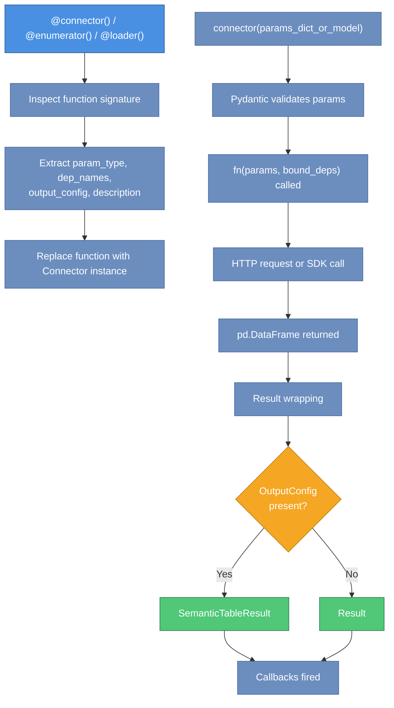
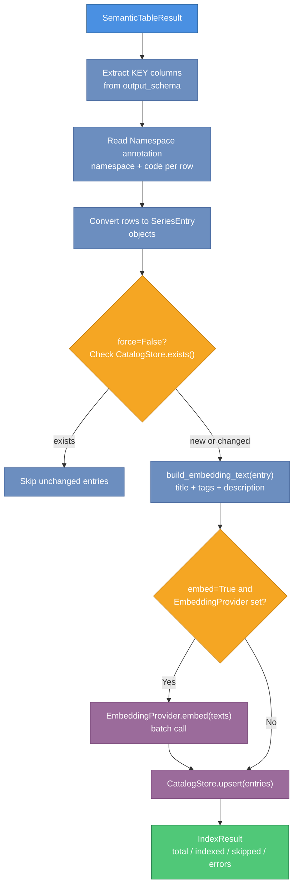

# parsimony Architecture

**Version**: 0.1.0  
**Audience**: Contributors, integrators, and developers who need to extend the library

This document describes the internal design of parsimony: the connector pattern and its three decorator variants, the catalog abstraction, the HTTP transport layer, and how the 9 modules and 33 connector functions are organized and composed.

---

## Table of Contents

1. [Design Philosophy](#design-philosophy)
2. [Module Organization](#module-organization)
3. [The Connector Pattern](#the-connector-pattern)
4. [Decorator Variants and Schema Contracts](#decorator-variants-and-schema-contracts)
5. [Dependency Injection Flow](#dependency-injection-flow)
6. [Result and Schema Layer](#result-and-schema-layer)
7. [Catalog Subsystem](#catalog-subsystem)
8. [HTTP Transport Layer](#http-transport-layer)
9. [Connector Implementations: 9 Modules, 33 Functions](#connector-implementations-9-modules-33-functions)
10. [Connector Composition and Injection](#connector-composition-and-injection)
11. [Data Flow Diagrams](#data-flow-diagrams)
12. [Dependency Graph](#dependency-graph)
13. [Key Design Decisions](#key-design-decisions)

---

## Design Philosophy

parsimony is built around three core principles:

**Uniform interface**. Every data source — whether it is FRED's REST API, an SDMX provider, or a local IBKR gateway — exposes the same calling convention: an async function that accepts a Pydantic model and returns a typed DataFrame wrapped in a `Result`.

**Immutability**. The `Connector` and `Connectors` types are frozen dataclasses. Every operation that would modify them — binding dependencies, attaching callbacks, filtering — returns a new instance. The original is never mutated.

**Pluggable backends**. The catalog and data store are defined as abstract base classes (`CatalogStore`, `DataStore`). In-memory implementations are bundled for development. Production backends (e.g. Supabase) are external and injected at construction time.

---

## Module Organization

```
parsimony/
├── __init__.py               # Public API surface (__all__)
├── connector.py              # Connector, Connectors, decorators
├── result.py                 # Result, SemanticTableResult, OutputConfig, Column, ColumnRole
├── data_store.py             # DataStore ABC, LoadResult
├── catalog/
│   ├── catalog.py            # Catalog orchestration layer
│   ├── store.py              # CatalogStore ABC
│   ├── models.py             # SeriesEntry, SeriesMatch, IndexResult (Pydantic)
│   ├── embeddings.py         # EmbeddingProvider ABC
│   ├── series_pipeline.py    # build_embedding_text(), text composition for indexing
│   └── identity_from_params.py  # Namespace field extraction utilities
├── stores/
│   ├── memory.py             # SQLiteCatalogStore
│   └── memory_data.py        # InMemoryDataStore
├── embeddings/
│   └── litellm.py            # LiteLLMEmbeddingProvider
├── transport/
│   ├── http.py               # HttpClient wrapping httpx; API key log redaction
│   └── json_helpers.py       # json_to_df(), interpolate_path()
└── connectors/
    ├── __init__.py           # build_fetch_connectors_from_env(), build_connectors_from_env()
    ├── fred.py               # 3 connectors: fred_search, fred_fetch, enumerate_fred_release
    ├── sdmx.py               # 5 connectors + enumerate_sdmx_dataset_codelists()
    ├── fmp.py                # 18 connectors
    ├── fmp_screener.py       # 1 connector: fmp_screener (fan-out pattern)
    ├── sec_edgar.py          # 1 connector: sec_edgar_fetch
    ├── eodhd.py              # 1 connector: eodhd_fetch
    ├── ibkr.py               # 1 connector: ibkr_fetch
    ├── polymarket.py         # 2 connectors: polymarket_gamma_fetch, polymarket_clob_fetch
    └── financial_reports.py  # 1 connector: financial_reports_fetch
```

The dependency graph is a directed acyclic graph. The two most widely imported modules are `result.py` and `catalog/models.py`. No circular dependencies exist.

---

## The Connector Pattern

The central abstraction is the `Connector` frozen dataclass defined in `connector.py`.

```python
@dataclass(frozen=True)
class Connector:
    name: str
    description: str
    tags: frozenset[str]
    param_type: type[BaseModel]       # Pydantic model for params validation
    dep_names: frozenset[str]         # Required keyword-only deps (must be bound)
    optional_dep_names: frozenset[str]# Optional keyword-only deps (may be absent)
    fn: Callable                      # The wrapped async function (partial after bind_deps)
    output_config: OutputConfig | None
    callbacks: tuple[ResultCallback, ...]
```

The following diagram shows the complete execution flow from decorator application through to the returned result.



When a developer writes a connector function using the `@connector()` decorator, the decorator inspects the function signature to extract:

- `param_type`: the Pydantic `BaseModel` subclass that is the first positional parameter.
- `dep_names`: keyword-only parameters (after `*`) that have no default value and are not yet bound.
- `output_config`: taken from the `output=` argument to the decorator.
- `description`: from the function docstring.

The decorator replaces the function with a `Connector` instance. Calling the `Connector` with a params dict or model instance triggers Pydantic validation, calls the wrapped function, and wraps the return value in a `Result` or `SemanticTableResult`.

### Immutability pattern

All mutation operations on `Connector` return a new instance:

```python
# bind_deps returns a new Connector with fn replaced by a partial
bound = connector.bind_deps(api_key="secret")

# with_callback returns a new Connector with callbacks extended
logged = connector.with_callback(my_callback)

# Original connector is unchanged
assert connector.dep_names == frozenset({"api_key"})
assert bound.dep_names == frozenset()
```

`Connectors` follows the same pattern. The `+` operator, `.filter()`, `.bind_deps()`, and `.with_callback()` all return new `Connectors` instances.

---

## Decorator Variants and Schema Contracts

Three decorator factories are provided, each enforcing a different column-role contract on the `OutputConfig`.

| Decorator | KEY required | TITLE required | DATA allowed | METADATA allowed | Primary use case |
|-----------|:-----------:|:--------------:|:------------:|:----------------:|-----------------|
| `@connector()` | No | No | Yes | Yes | General search, profile, fetch |
| `@enumerator(output)` | Yes (with namespace) | Yes | No | Yes | Catalog population: list series IDs |
| `@loader(output)` | Yes (with namespace) | No | Yes | No | Observation loading: time series data |

The `output` parameter is mandatory for `@enumerator` and `@loader`; it is optional for `@connector`. When `output` is present, the connector automatically wraps its return value in a `SemanticTableResult` instead of a plain `Result`.

```python
# @enumerator enforces KEY + TITLE, no DATA
@enumerator(output=OutputConfig(columns=[
    Column(name="series_id", role=ColumnRole.KEY,   dtype="str", namespace="fred"),
    Column(name="title",     role=ColumnRole.TITLE, dtype="str"),
]))
async def enumerate_fred_release(params: FredReleaseParams, *, api_key: str) -> pd.DataFrame:
    ...

# @loader enforces KEY + DATA, no TITLE/METADATA
@loader(output=OutputConfig(columns=[
    Column(name="series_id", role=ColumnRole.KEY,  dtype="str", namespace="fred"),
    Column(name="date",      role=ColumnRole.DATA, dtype="date"),
    Column(name="value",     role=ColumnRole.DATA, dtype="float64"),
]))
async def fred_fetch(params: FredFetchParams, *, api_key: str) -> pd.DataFrame:
    ...
```

The schema contracts exist to make catalog indexing and data loading reliable. An `@enumerator` result can always be safely passed to `Catalog.index_result()` because it is guaranteed to have identifiable series codes. A `@loader` result can always be safely passed to `DataStore.load_result()` because it is guaranteed to have data columns.

---

## Dependency Injection Flow

The dependency injection mechanism allows connector functions to declare API keys or other runtime dependencies as keyword-only parameters, without coupling the connector to any specific credential store.

```
connector_fn(params, *, api_key: str)     # declares dep: api_key
    ↓
Connector(dep_names=frozenset({"api_key"}), fn=connector_fn)
    ↓ .bind_deps(api_key=os.getenv("FRED_API_KEY"))
Connector(dep_names=frozenset(), fn=partial(connector_fn, api_key=...))
    ↓ connector({"series_id": "GDP"})
1. Pydantic validates params dict → FredFetchParams(series_id="GDP")
2. fn(params, **bound_deps) called
3. Return value wrapped in Result or SemanticTableResult
4. Callbacks fired with the Result
    ↓
Result returned to caller
```

Dependencies bound via `bind_deps()` become part of the function partial. They are never stored in `Provenance` (which only contains the Pydantic params model fields). This ensures API keys do not appear in lineage records, logs, or serialized results.

The factory functions `build_fetch_connectors_from_env()` and `build_connectors_from_env()` call `bind_deps()` internally:

```python
# Internal pattern used by factory functions
fred_connectors = Connectors([fred_search, fred_fetch, enumerate_fred_release])
fred_bound = fred_connectors.bind_deps(api_key=os.environ["FRED_API_KEY"])
```

---

## Result and Schema Layer

The `result.py` module defines the output contract for all connectors. It is a standalone module with no internal dependencies beyond pandas and pyarrow.

```
Raw API response (JSON/CSV)
    ↓ connector implementation
pd.DataFrame
    ↓ Connector.__call__()
Result(data=df, provenance=Provenance(...))
    ↓ (when OutputConfig is present)
SemanticTableResult(data=df, provenance=..., output_schema=OutputConfig(...))
```

`SemanticTableResult` extends `Result` with a required `output_schema`. It exposes typed column groups:

- `entity_keys`: `ColumnRole.KEY` columns (series identifiers with namespace)
- `data_columns`: `ColumnRole.DATA` columns (numeric observations)
- `metadata_columns`: `ColumnRole.METADATA` columns (ancillary context)

Both types support Arrow and Parquet serialization. The `OutputConfig` schema is stored in Arrow table metadata, enabling schema recovery on deserialization.

If a connector returns a plain `Result` but the caller needs schema information, they can call `result.to_table(output_config)` to produce a `SemanticTableResult` without re-fetching.

---

## Catalog Subsystem

The catalog subsystem (`parsimony/catalog/`) manages the lifecycle of series metadata: indexing, deduplication, embedding, and search.

### Component responsibilities

| Component | File | Responsibility |
|-----------|------|---------------|
| `Catalog` | `catalog.py` | Orchestration: indexing pipeline, search routing, embedding coordination |
| `CatalogStore` | `store.py` | Persistence ABC: CRUD + text search + vector search |
| `SeriesEntry` / `SeriesMatch` / `IndexResult` | `models.py` | Pydantic data models for catalog records and results |
| `EmbeddingProvider` | `embeddings.py` | ABC for text-to-vector embedding |
| `build_embedding_text` | `series_pipeline.py` | Composes text from `SeriesEntry` fields for embedding; format affects search quality |
| `identity_from_params` | `identity_from_params.py` | Extracts `(namespace, code)` from a Pydantic params model using `Namespace` annotations |

### Indexing pipeline

When `Catalog.index_result()` is called with a `SemanticTableResult`:

1. Each row with a KEY column is extracted and converted to a `SeriesEntry` using the `Namespace` annotation to determine `namespace` and `code`.
2. If `force=False`, existing entries in the store are checked; unchanged entries are skipped.
3. `build_embedding_text()` composes a text string from each entry's `title`, `tags`, `description`, and `metadata` fields.
4. If `embed=True` and an `EmbeddingProvider` is configured, `EmbeddingProvider.embed()` is called on the batch of texts.
5. Entries (with optional embeddings) are upserted into the `CatalogStore`.
6. An `IndexResult` summarizing `total`, `indexed`, `skipped`, and `errors` is returned.

### Identity resolution

The `Namespace` metadata annotation on a Pydantic field is the bridge between connector params and catalog identity:

```python
class FredFetchParams(BaseModel):
    series_id: Annotated[str, Namespace("fred")]
```

`identity_from_params()` inspects the params model, finds the field annotated with `Namespace`, and returns `(namespace, code)`. The constraint is that exactly one `Namespace`-annotated field may exist per params model. A params model without a `Namespace` field cannot be used to auto-resolve identity.

### Search routing

`Catalog.search()` dispatches to either token-based or vector-based search depending on the `semantic=` flag:

- `semantic=False`: delegates to `CatalogStore.search()` (text/token matching).
- `semantic=True`: calls `EmbeddingProvider.embed([query])` to get the query vector, then delegates to `CatalogStore.vector_search()`. Requires an `EmbeddingProvider` configured on the `Catalog`.

---

## HTTP Transport Layer

The `transport/` directory provides two utilities used by connector implementations.

### `HttpClient` (`transport/http.py`)

A thin wrapper around `httpx.AsyncClient`. Connectors instantiate `HttpClient` with a base URL and optional default query parameters (including the API key).

**Key behaviors**:

- A new `httpx.AsyncClient` is created per request. This avoids event loop sharing issues that arise when callers use multiple `asyncio.run()` calls in sequence, at the cost of connection setup overhead per request.
- Query parameter values whose names appear in `_SENSITIVE_QUERY_PARAM_NAMES` are redacted to `"***REDACTED***"` in structured HTTP logs.
- The redacted names include: `api_key`, `apikey`, `token`, `access_token`, `refresh_token`, `id_token`, `client_secret`, `secret`, `password`, `authorization`, and any name ending in `_token`.

If a new connector introduces an API key with a non-standard query parameter name, that name must be added to `_SENSITIVE_QUERY_PARAM_NAMES`.

### `json_helpers.py`

Two utility functions used by FMP and Polymarket connectors:

- `json_to_df(data, ...)`: converts a JSON response body (list of dicts, indexed dict, or date-keyed dict) to a pandas DataFrame. Handles nested dict detection and `TableRef` references for nested content.
- `interpolate_path(path_template, params)`: substitutes path parameters from a params model into a URL path template (e.g. `"/profile/{symbol}"` with `FmpCompanyProfileParams(symbol="AAPL")` → `"/profile/AAPL"`).

---

## Connector Implementations: 9 Modules, 33 Functions

Each data-source module in `connectors/` follows the same structure:

1. Param models (one `BaseModel` subclass per connector).
2. One or more `OutputConfig` constants defining the column schema.
3. Connector functions decorated with `@connector`, `@enumerator`, or `@loader`.
4. A module-level `CONNECTORS` or `FETCH_CONNECTORS` constant (a `list` or `Connectors` instance) used by the factory functions.

### Module summary

| Module | Functions | Key dependency |
|--------|-----------|---------------|
| `fred.py` | 3 | `FRED_API_KEY` + httpx |
| `sdmx.py` | 5 (+ 1 non-connector helper) | `sdmx1` package |
| `fmp.py` | 18 | `FMP_API_KEY` + httpx |
| `fmp_screener.py` | 1 | `FMP_API_KEY` + httpx (fan-out) |
| `sec_edgar.py` | 1 | `edgartools` (sync, wrapped) |
| `eodhd.py` | 1 | `EODHD_API_KEY` + httpx |
| `ibkr.py` | 1 | `IBKR_WEB_API_BASE_URL` + httpx |
| `polymarket.py` | 2 | httpx only |
| `financial_reports.py` | 1 | `FINANCIAL_REPORTS_API_KEY` + SDK |

### Async transport strategies per module

- **FRED, FMP, EODHD, IBKR, Polymarket**: use `HttpClient` (httpx-based async).
- **SDMX**: uses the `sdmx1` library's own async transport; `sdmx_fetch` yields a `pandasdmx` DataMessage.
- **SEC Edgar**: uses `edgartools`, a synchronous library. The connector wraps it in `_SecEdgarEngine`, a dispatch class that runs synchronous calls.
- **Financial Reports**: uses the `financial-reports-generated-client` SDK, which provides its own async client.

### FMP Screener fan-out pattern

`fmp_screener` performs three concurrent API calls for each batch of screener results:

1. `/company-screener` — primary filter results.
2. `/key-metrics-ttm/{symbol}` — per-symbol key metrics (concurrent, semaphore-limited to 10).
3. `/financial-ratios-ttm/{symbol}` — per-symbol financial ratios (concurrent, semaphore-limited to 10).

The semaphore limit (`_SEMAPHORE_LIMIT = 10`) prevents overwhelming the FMP rate limit. Results are merged by symbol. If the `where_clause` parameter is set, it is applied as a `DataFrame.query()` filter on the merged DataFrame.

---

## Connector Composition and Injection

The factory functions in `connectors/__init__.py` compose the per-module connector lists into bundles and bind API keys:

```
connectors/__init__.py
    build_fetch_connectors_from_env(env)
        → reads FRED_API_KEY, FMP_API_KEY, EODHD_API_KEY, IBKR_WEB_API_BASE_URL, FINANCIAL_REPORTS_API_KEY
        → for each key present: binds key to the corresponding connector bundle
        → concatenates all bound bundles into one Connectors instance
        → returns Connectors

    build_connectors_from_env(*, env)
        → calls build_fetch_connectors_from_env()
        → adds search and screener connectors
        → returns Connectors
```

If `EODHD_API_KEY`, `IBKR_WEB_API_BASE_URL`, or `FINANCIAL_REPORTS_API_KEY` are absent, the corresponding connectors are silently excluded. `FRED_API_KEY` and `FMP_API_KEY` are required for the base bundle.

Connectors for SDMX (no key needed), SEC Edgar (no key needed), and Polymarket (no key needed) are always included in `build_connectors_from_env()` when their respective package dependencies are installed.

---

## Data Flow Diagrams

The following narrative describes the data flow for a typical connector call.

**Fetch call flow**:

```
Caller
  → connectors["fred_fetch"]({"series_id": "GDP"})
  → Connector.__call__()
      → Pydantic: validate dict → FredFetchParams(series_id="GDP")
      → fn(params, api_key="...") called
          → HttpClient.get("/series/observations", params={...})
          → JSON response parsed to pd.DataFrame
          → DataFrame returned
      → Result.from_dataframe(df, Provenance(...)) created
      → SemanticTableResult wrapping applied (OutputConfig present)
      → callbacks fired
  → SemanticTableResult returned to caller
```

The diagram below maps this narrative to the concrete types involved at each step.

```mermaid
graph LR
    classDef caller fill:#4A90E2,stroke:#2E5C8A,color:#fff
    classDef connector fill:#6C8EBF,stroke:#4A6A9F,color:#fff
    classDef transport fill:#9B6B9B,stroke:#7A4A7A,color:#fff
    classDef result fill:#50C878,stroke:#2E7D50,color:#fff

    A["Caller\nparams dict"]:::caller
    B["Connector.__call__()"]:::connector
    C["Pydantic validation\nFredFetchParams"]:::connector
    D["fn(params, api_key=...)"]:::connector
    E["HttpClient.get()"]:::transport
    F["JSON → pd.DataFrame"]:::transport
    G["Result / SemanticTableResult"]:::result
    H["Callbacks fired"]:::result

    A --> B --> C --> D --> E --> F --> G --> H
```



**Catalog indexing flow**:

```
SemanticTableResult (from connector)
  → Catalog.index_result(result)
      → KEY columns extracted from output_schema
      → Namespace annotation read: namespace="fred"
      → Each row → SeriesEntry(namespace="fred", code="GDP", title="...", ...)
      → CatalogStore.exists() checked per entry (unless force=True)
      → build_embedding_text(entry) called
      → EmbeddingProvider.embed(texts) called (if embed=True)
      → CatalogStore.upsert(entries) called
  → IndexResult(total, indexed, skipped, errors) returned
```

The diagram below shows the catalog indexing pipeline from a `SemanticTableResult` through to the persisted `IndexResult`.



---

## Dependency Graph

The internal dependency structure (simplified, showing import direction):

```
result.py           ← (standalone: pandas, pyarrow)
catalog/models.py   ← (standalone: pydantic)

connector.py        ← result.py
catalog/store.py    ← catalog/models.py
catalog/catalog.py  ← catalog/store.py, catalog/models.py, catalog/embeddings.py, result.py
data_store.py       ← catalog/models.py, result.py

stores/memory.py         ← catalog/models.py, catalog/store.py
stores/memory_data.py    ← catalog/models.py, data_store.py
embeddings/litellm.py    ← catalog/embeddings.py, litellm (optional)

transport/http.py        ← httpx
transport/json_helpers.py← pandas

connectors/fred.py       ← connector.py, result.py, transport/http.py
connectors/sdmx.py       ← connector.py, result.py (sdmx1 optional)
connectors/fmp.py        ← connector.py, result.py, transport/http.py, transport/json_helpers.py
connectors/__init__.py   ← all connector modules
```

No circular dependencies. `result.py` and `catalog/models.py` have the highest in-degree (most modules depend on them). Changes to these two files have the widest blast radius.

---

## Key Design Decisions

### Why frozen dataclasses for Connector and Connectors?

Immutability makes connector bundles safe to share across coroutines without locks. It also makes the `bind_deps()` and `with_callback()` patterns composable: you can create variations of a bundle without affecting other parts of the codebase that hold references to the original.

### Why create a new httpx.AsyncClient per request?

A shared `AsyncClient` across multiple `asyncio.run()` calls (each of which creates a new event loop) would raise `RuntimeError: Event loop is closed`. The per-request client avoids this at the cost of TCP connection setup overhead. The comment in `transport/http.py` documents this rationale explicitly.

### Why separate Result from SemanticTableResult?

Not all connectors have fully declared schemas. Keeping `Result` as the base type allows connectors to return raw DataFrames without requiring every implementer to write a complete `OutputConfig`. `SemanticTableResult` is opt-in and adds semantic meaning when needed (catalog indexing, agent tool generation, column filtering).

### Why are dep_names and optional_dep_names separate?

`dep_names` must be bound before the connector is callable. `optional_dep_names` may be absent at call time without error. This distinction allows connectors that have optional credentials (e.g. `SEC_EDGAR_USER_AGENT`) to express that the dep is present-if-available rather than required.

### Why is the Supabase backend external to this package?

parsimony is a client library. It does not manage any schema or runtime infrastructure. The `CatalogStore` and `DataStore` ABCs define the contracts; production backends are injected by the consuming application. This keeps the package self-contained and testable with in-memory implementations.
