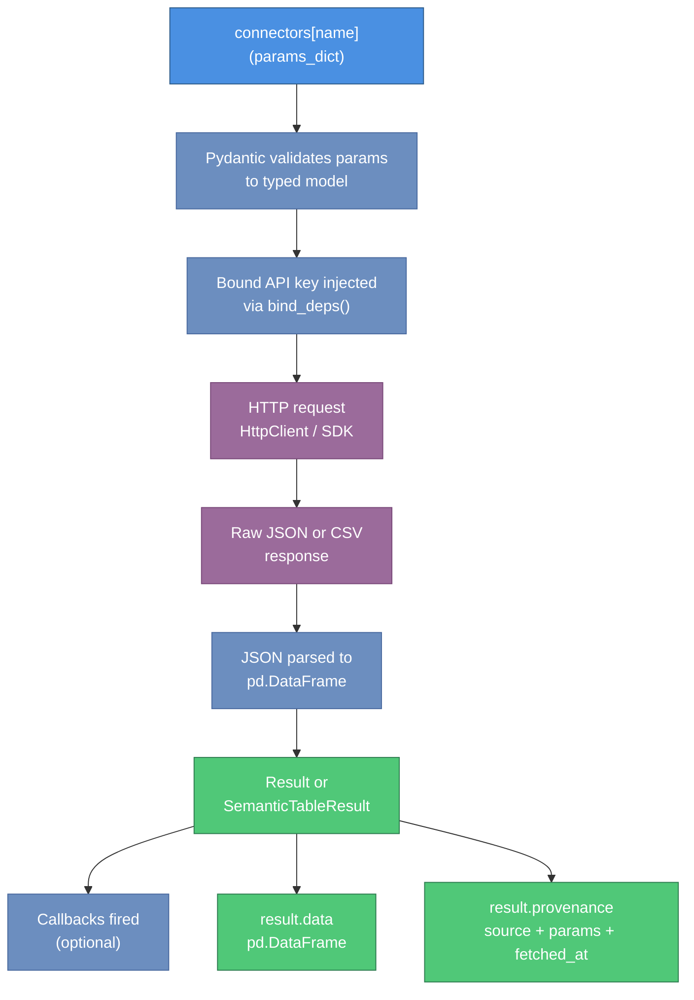

# ockham User Guide

**Version**: 0.1.0  
**Audience**: Python developers building data pipelines, notebooks, or agent integrations

ockham is a Python library that gives you a single, consistent async interface for fetching financial and macroeconomic data from FRED, SDMX providers (ECB, Eurostat, IMF, World Bank, BIS), Financial Modeling Prep, SEC Edgar, EODHD, Interactive Brokers, Polymarket, and Financial Reports APIs. All results are typed pandas DataFrames with provenance metadata and optional column-role schemas.

---

## Table of Contents

1. [Installation](#installation)
2. [Environment Variable Setup](#environment-variable-setup)
3. [Quick Start](#quick-start)
4. [Fetching Data from FRED](#fetching-data-from-fred)
5. [Querying SDMX Providers](#querying-sdmx-providers)
6. [Working with FMP Equity Data](#working-with-fmp-equity-data)
7. [Using the Series Catalog](#using-the-series-catalog)
8. [Creating Custom Connectors](#creating-custom-connectors)
9. [Working with Results](#working-with-results)
10. [Filtering and Composing Connector Bundles](#filtering-and-composing-connector-bundles)
11. [Common Patterns](#common-patterns)
12. [MCP Server (Coding Agent Integration)](#mcp-server-coding-agent-integration)

---

## Installation

ockham is not yet published on PyPI. Install directly from source.

### From source

```bash
# Clone the monorepo (or the package directory)
git clone <repository-url>
cd packages/ockham

pip install -e .
```

### With optional dependencies

Install the `sdmx` extra to enable SDMX provider support (ECB, Eurostat, IMF, World Bank, BIS):

```bash
pip install -e ".[sdmx]"
```

Install the `embeddings` extra to enable semantic catalog search:

```bash
pip install -e ".[embeddings]"
```

Install both together:

```bash
pip install -e ".[sdmx,embeddings]"
```

### Separately-installed packages

Two connectors require packages that are not declared in `pyproject.toml` and must be installed manually:

```bash
# Required for SEC Edgar connector
pip install edgartools

# Required for Financial Reports connector
pip install financial-reports-generated-client
```

### Python version requirement

ockham requires Python **3.11 or 3.12**. Python 3.13 is not supported due to a dependency constraint.

---

## Environment Variable Setup

Different connectors require different credentials. Set the variables for the data sources you intend to use.

| Variable | Required | Used By |
|----------|----------|---------|
| `FRED_API_KEY` | Yes (for FRED) | All FRED connectors |
| `FMP_API_KEY` | Yes (for FMP) | All FMP connectors and FMP Screener |
| `EODHD_API_KEY` | Optional | EODHD connector |
| `IBKR_WEB_API_BASE_URL` | Optional | IBKR connector (local gateway URL) |
| `FINANCIAL_REPORTS_API_KEY` | Optional | Financial Reports connector |
| `SEC_EDGAR_USER_AGENT` | Optional | SEC Edgar connector (request identification) |
| `EDGAR_IDENTITY` | Optional | SEC Edgar connector (alternative to `SEC_EDGAR_USER_AGENT`) |

SDMX and Polymarket connectors require no credentials.

Set variables in your shell or a `.env` file:

```bash
export FRED_API_KEY="your-fred-api-key"
export FMP_API_KEY="your-fmp-api-key"
export EODHD_API_KEY="your-eodhd-key"       # optional
```

To obtain a FRED API key, register at [https://fred.stlouisfed.org/docs/api/api_key.html](https://fred.stlouisfed.org/docs/api/api_key.html).

---

## Quick Start

The fastest way to get started is to call `build_connectors_from_env()`. This reads your environment variables, injects the appropriate API keys, and returns a ready-to-use `Connectors` bundle.

The diagram below shows the complete data flow from a connector call through to the `pd.DataFrame` you use in your code.



```python
import asyncio
from ockham.connectors import build_connectors_from_env

async def main():
    # Build the full connector bundle from environment variables
    connectors = build_connectors_from_env()

    # Fetch US GDP data from FRED
    result = await connectors["fred_fetch"]({"series_id": "GDP"})

    print(result.data.tail())
    print(result.provenance)

asyncio.run(main())
```

Expected output (example):

```
         date     value
2023-01-01  26408.4
2023-04-01  26960.4
2023-07-01  27357.8
2023-10-01  27940.4
2024-01-01  28269.7

Provenance(source='fred', params={'series_id': 'GDP'}, fetched_at=datetime(...))
```

---

## Fetching Data from FRED

### Search for a series

```python
import asyncio
from ockham.connectors import build_connectors_from_env

async def search_fred():
    connectors = build_connectors_from_env()

    # Search for series related to inflation
    result = await connectors["fred_search"]({"query": "consumer price index", "limit": 5})
    print(result.data[["id", "title"]])

asyncio.run(search_fred())
```

### Fetch a specific series with a date range

```python
async def fetch_unemployment():
    connectors = build_connectors_from_env()

    result = await connectors["fred_fetch"]({
        "series_id": "UNRATE",
        "observation_start": "2020-01-01",
        "observation_end": "2024-12-31",
    })

    df = result.data
    print(f"Fetched {len(df)} observations")
    print(df.tail(3))
```

### Enumerate all series in a FRED release

```python
async def enumerate_release():
    connectors = build_connectors_from_env()

    # FRED Release 10 is the Employment Situation
    result = await connectors["enumerate_fred_release"]({"release_id": 10})

    print(f"Found {len(result.data)} series in this release")
    print(result.data.head())
```

---

## Querying SDMX Providers

SDMX connectors require the `sdmx1` package. Install with `pip install ockham[sdmx]`.

No API key is required. SDMX providers include ECB, Eurostat (ESTAT), IMF, World Bank (WB), BIS, and others.

```python
async def sdmx_examples():
    connectors = build_connectors_from_env()

    # List all ECB datasets
    datasets = await connectors["sdmx_list_datasets"]({"provider": "ECB"})
    print(datasets.data.head(10))

    # Get the Data Structure Definition for the ECB exchange rate dataset
    dsd = await connectors["sdmx_dsd"]({"provider": "ECB", "dataset_id": "EXR"})
    print(dsd.data)

    # Fetch daily USD/EUR spot rate observations
    rates = await connectors["sdmx_fetch"]({
        "provider": "ECB",
        "dataset_id": "EXR",
        "key": "D.USD.EUR.SP00.A",
        "start_period": "2023-01-01",
        "end_period": "2024-12-31",
    })
    print(rates.data.tail())

    # Enumerate series keys for catalog ingestion
    keys = await connectors["sdmx_series_keys"]({
        "provider": "ESTAT",
        "dataset_id": "namq_10_gdp",
    })
    print(f"Found {len(keys.data)} series keys")
```

---

## Working with FMP Equity Data

FMP connectors require `FMP_API_KEY`. The calling pattern is the same as FRED: pass a dict matching the connector's params model.

```python
async def fmp_examples():
    connectors = build_connectors_from_env()

    # Search for companies
    search = await connectors["fmp_search"]({"query": "Apple", "limit": 5})
    print(search.data[["symbol", "name", "exchangeShortName"]])

    # Historical prices
    prices = await connectors["fmp_prices"]({
        "symbol": "AAPL",
        "from_date": "2024-01-01",
        "to_date": "2024-12-31",
    })
    print(prices.data.tail())

    # Annual income statements
    income = await connectors["fmp_income_statements"]({
        "symbol": "MSFT",
        "period": "annual",
        "limit": 5,
    })
    print(income.data[["date", "revenue", "netIncome"]].head())

    # Screen for large-cap tech
    screener = await connectors["fmp_screener"]({
        "sector": "Technology",
        "market_cap_more_than": 10_000_000_000,
        "exchange": "NASDAQ",
        "limit": 20,
        # where_clause="revenueGrowth > 0.1",  # pandas query string — trusted input only
    })
    print(screener.data.head())
```

> **Warning**: The `where_clause` parameter in `fmp_screener` uses `DataFrame.query()` internally. Do not pass untrusted user input as a `where_clause` value.

---

## Using the Series Catalog

The catalog lets you index discovered series and search them by text or semantic similarity.

### Basic setup with in-memory storage

```python
import asyncio
from ockham import SeriesCatalog, InMemoryCatalogStore
from ockham.connectors import build_connectors_from_env

async def catalog_example():
    connectors = build_connectors_from_env()
    catalog = SeriesCatalog(InMemoryCatalogStore())

    # Enumerate all series in a FRED release and index them
    result = await connectors["enumerate_fred_release"]({"release_id": 10})
    index_summary = await catalog.index_result(result)

    print(f"Indexed {index_summary.indexed} series, skipped {index_summary.skipped}")

    # Search the catalog
    matches = await catalog.search("unemployment rate", limit=5)
    for match in matches:
        print(f"  {match.namespace}/{match.code}: {match.title}")

asyncio.run(catalog_example())
```

### Using the `dry_run` option

```python
# Preview what would be indexed without writing to the store
summary = await catalog.index_result(result, dry_run=True)
print(f"Would index {summary.indexed} entries")
```

### Semantic search with embeddings

Semantic search requires the `[embeddings]` extra and a LiteLLM-compatible embedding model.

```python
from ockham import LiteLLMEmbeddingProvider, SeriesCatalog, InMemoryCatalogStore

async def semantic_search():
    provider = LiteLLMEmbeddingProvider(
        model="gemini/text-embedding-004",
        dimension=768,
    )
    catalog = SeriesCatalog(InMemoryCatalogStore(), embeddings=provider)

    # Index some results (embeddings are computed during indexing)
    result = await connectors["enumerate_fred_release"]({"release_id": 10})
    await catalog.index_result(result, embed=True)

    # Search using semantic similarity
    matches = await catalog.search("jobs market labor", limit=5, semantic=True)
    for match in matches:
        print(f"  {match.similarity:.3f}  {match.title}")
```

### Listing and retrieving catalog entries

```python
# List all namespaces
namespaces = await catalog.list_namespaces()

# Paginate through entries in a namespace
entries = await catalog.list_entries(namespace="fred", limit=50, offset=0)

# Retrieve a specific entry
entry = await catalog.get_entry(namespace="fred", code="UNRATE")
if entry:
    print(entry.title)
```

---

## Creating Custom Connectors

You can build your own connectors using the `@connector`, `@enumerator`, or `@loader` decorators. Custom connectors integrate seamlessly with `Connectors` bundles and the catalog.

### Minimal custom connector

```python
import pandas as pd
from pydantic import BaseModel
from ockham import connector, Result

class MyParams(BaseModel):
    symbol: str
    limit: int = 10

@connector(tags=["custom"])
async def my_data_source(params: MyParams) -> pd.DataFrame:
    """Fetch data from my internal API."""
    # Replace with real HTTP call
    return pd.DataFrame({
        "date": pd.date_range("2024-01-01", periods=params.limit, freq="D"),
        "value": range(params.limit),
    })
```

### Custom connector with a declared schema

Use `OutputConfig` and `Column` to declare the semantic meaning of each column:

```python
from typing import Annotated
from pydantic import BaseModel
from ockham import (
    connector, loader, Namespace,
    OutputConfig, Column, ColumnRole,
)

class PriceParams(BaseModel):
    ticker: Annotated[str, Namespace("my_source")]

PRICE_OUTPUT = OutputConfig(columns=[
    Column(name="ticker", role=ColumnRole.KEY, dtype="str", namespace="my_source"),
    Column(name="date",   role=ColumnRole.METADATA, dtype="date"),
    Column(name="close",  role=ColumnRole.DATA, dtype="float64"),
    Column(name="volume", role=ColumnRole.DATA, dtype="float64"),
])

@loader(output=PRICE_OUTPUT)
async def my_prices(params: PriceParams) -> pd.DataFrame:
    """Fetch daily closing prices from my source."""
    # Your implementation here
    return pd.DataFrame(...)
```

### Custom connector with dependency injection

Use keyword-only function parameters to declare dependencies (such as API keys):

```python
from pydantic import BaseModel
from ockham import connector, Connectors

class SearchParams(BaseModel):
    query: str

@connector(tags=["custom"])
async def my_authenticated_source(params: SearchParams, *, api_key: str) -> pd.DataFrame:
    """Fetch from an authenticated API."""
    # api_key is injected via bind_deps; never stored in params
    ...

# Bind the API key before adding to a bundle
bound = my_authenticated_source.bind_deps(api_key="secret-key")

# Combine with the standard bundle
from ockham.connectors import build_connectors_from_env
all_connectors = build_connectors_from_env() + Connectors([bound])
```

### Adding a result callback

Callbacks let you react to every result produced by a connector, for example to store it in a database or emit a metric:

```python
async def log_result(result):
    print(f"Got result from {result.provenance.source}: {len(result.data)} rows")

# Attach callback to a single connector
logged_connector = connectors["fred_fetch"].with_callback(log_result)

# Attach callback to all connectors in a bundle
logged_bundle = connectors.with_callback(log_result)
```

---

## Working with Results

### Accessing the DataFrame and provenance

```python
result = await connectors["fred_fetch"]({"series_id": "GDP"})

df = result.data           # pandas DataFrame
prov = result.provenance   # Provenance(source, params, fetched_at, ...)

print(prov.source)         # "fred"
print(prov.fetched_at)     # datetime of the fetch
print(prov.params)         # {"series_id": "GDP"}
```

### Promoting a Result to SemanticTableResult

If a connector returns a plain `Result` but you want to apply a schema:

```python
from ockham import OutputConfig, Column, ColumnRole

my_schema = OutputConfig(columns=[
    Column(name="date",  role=ColumnRole.METADATA, dtype="date"),
    Column(name="value", role=ColumnRole.DATA, dtype="float64"),
])

semantic_result = result.to_table(my_schema)

# Access typed column groups
print(semantic_result.data_columns)    # [Column(name="value", ...)]
print(semantic_result.entity_keys)     # [Column(name=..., role=KEY, ...)]
```

### Serializing to Arrow and Parquet

Results can be saved and loaded round-trip using Apache Arrow or Parquet:

```python
# Save to Parquet
result.to_parquet("/tmp/gdp.parquet")

# Load from Parquet
from ockham import Result
loaded = Result.from_parquet("/tmp/gdp.parquet")

# Arrow round-trip
table = result.to_arrow()
restored = Result.from_arrow(table)
```

---

## Filtering and Composing Connector Bundles

### Filter by tag

```python
connectors = build_connectors_from_env()

# Only equity connectors
equity = connectors.filter(["equity"])

# Only macro connectors
macro = connectors.filter(["macro"])
```

### Combine bundles

```python
from ockham import Connectors

custom = Connectors([my_prices, my_authenticated_source])
combined = build_connectors_from_env() + custom

# Use any connector by name
result = await combined["my_prices"]({"ticker": "AAPL"})
```

### Generate LLM tool descriptions

All connectors in a bundle can be serialized to a text description suitable for inclusion in an LLM prompt:

```python
tool_descriptions = connectors.to_llm()
print(tool_descriptions[:500])
```

Each connector's description includes its name, docstring, tags, and parameter names and types. This output is consumed by agent frameworks that route LLM calls to connectors.

---

## Common Patterns

### Pattern 1: Run connectors in an async context

All connector calls are `async`. In a script, wrap them in `asyncio.run()`:

```python
import asyncio
from ockham.connectors import build_connectors_from_env

async def main():
    connectors = build_connectors_from_env()
    result = await connectors["fred_fetch"]({"series_id": "CPIAUCSL"})
    print(result.data.tail())

asyncio.run(main())
```

In a Jupyter notebook, use `await` directly (notebooks run an event loop):

```python
connectors = build_connectors_from_env()
result = await connectors["fred_fetch"]({"series_id": "CPIAUCSL"})
result.data.tail()
```

### Pattern 2: Pass params as a dict or a Pydantic model

Both forms are accepted:

```python
# Dict form (converted internally by Pydantic)
result = await connectors["fred_fetch"]({"series_id": "GDP"})

# Model form
from ockham.connectors.fred import FredFetchParams
result = await connectors["fred_fetch"](FredFetchParams(series_id="GDP"))
```

### Pattern 3: Bulk catalog indexing from an enumerator

```python
catalog = SeriesCatalog(InMemoryCatalogStore())

# Enumerate S&P 500 constituents and index them
sp500_result = await connectors["fmp_index_constituents"]({"index": "sp500"})
summary = await catalog.index_result(sp500_result)

print(f"Catalog now has {summary.indexed} entries")
```

### Pattern 4: Fetch-only bundle for simpler setups

If you only need data fetching (no search/screener connectors):

```python
from ockham.connectors import build_fetch_connectors_from_env

fetch_only = build_fetch_connectors_from_env()
```

### Pattern 5: Handle missing optional connectors gracefully

When an optional env var is absent, the corresponding connector is excluded from the bundle. Check by name before calling:

```python
if "eodhd_fetch" in [c.name for c in connectors]:
    result = await connectors["eodhd_fetch"]({"symbol": "AAPL.US", "period": "d"})
```

---

## MCP Server (Coding Agent Integration)

ockham includes an MCP server that exposes search and discovery connectors as native tools for coding agents (Claude Code, Cursor, Windsurf). The agent can search for data directly, then fetch and analyze it via code execution.

```bash
pip install -e ".[mcp]"
```

```json
{
  "mcpServers": {
    "ockham": {
      "command": "python3",
      "args": ["-m", "ockham.mcp"],
      "env": {
        "FRED_API_KEY": "your-key",
        "FMP_API_KEY": "your-key"
      }
    }
  }
}
```

See [docs/mcp-setup.md](mcp-setup.md) for full configuration, environment variables, and how to expose new connectors as MCP tools.
