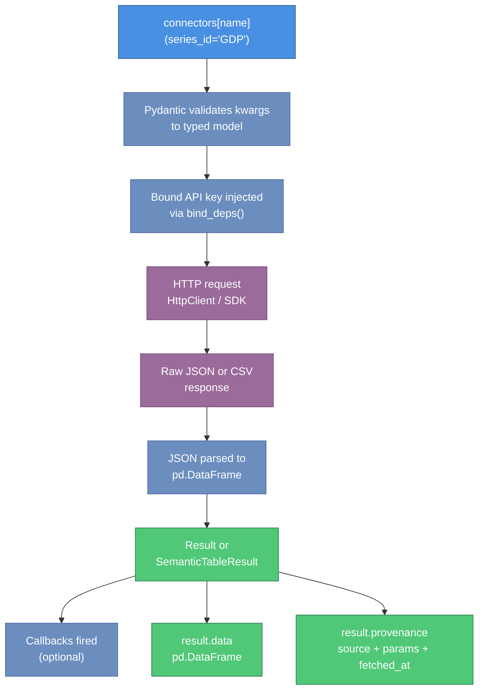

# parsimony User Guide

**Version**: 0.1.0
**Audience**: Python developers building data pipelines, notebooks, or agent integrations

parsimony is a Python library that gives you a single, consistent async interface for fetching financial and macroeconomic data from FRED, SDMX providers (ECB, Eurostat, IMF, World Bank, BIS), Financial Modeling Prep, SEC Edgar, EODHD, Polymarket, and more. All results are typed pandas DataFrames with provenance metadata and optional column-role schemas.

---

## Table of Contents

1. [Installation](#installation)
2. [Environment Setup](#environment-setup)
3. [Quick Start](#quick-start)
4. [Core Concepts](#core-concepts)
5. [Fetching Data from FRED](#fetching-data-from-fred)
6. [Querying SDMX Providers](#querying-sdmx-providers)
7. [Working with FMP Equity Data](#working-with-fmp-equity-data)
8. [Using the Catalog](#using-the-catalog)
9. [Creating Custom Connectors](#creating-custom-connectors)
10. [Working with Results](#working-with-results)
11. [Filtering and Composing Connector Bundles](#filtering-and-composing-connector-bundles)
12. [Common Patterns](#common-patterns)
13. [MCP Server (Coding Agent Integration)](#mcp-server-coding-agent-integration)

---

## Installation

```bash
pip install parsimony-core
```

### Optional extras

Connectors ship as separate distributions (discovered via the `parsimony.providers` entry point): `parsimony-fred`, `parsimony-sdmx`, `parsimony-fmp`, etc. The kernel itself has no connectors.

| Extra | Install command | What it enables |
|-------|----------------|-----------------|
| `standard` | `pip install "parsimony-core[standard]"` | Canonical `Catalog` — FAISS + BM25 + sentence-transformers + `hf://` loader |
| `litellm` | `pip install "parsimony-core[standard,litellm]"` | Hosted embeddings via the LiteLLM unified API (OpenAI, Gemini, Cohere, Voyage, Bedrock, …) |
| `s3` | `pip install "parsimony-core[standard,s3]"` | `s3://` URLs in `Catalog.from_url` / `Catalog.push` (planned) |
| `all` | `pip install "parsimony-core[all]"` | `standard + litellm + s3` |

The MCP server lives in a separate distribution:

```bash
pip install parsimony-mcp
```

### Python version

parsimony requires **Python 3.11+**.

---

## Environment Setup

Different connectors require different credentials. Set the variables for the data sources you intend to use.

| Variable | Required | Used By |
|----------|----------|---------|
| `FRED_API_KEY` | Yes | All FRED connectors |
| `FMP_API_KEY` | Optional | All FMP connectors and FMP Screener |
| `EODHD_API_KEY` | Optional | EODHD connector |
| `FINNHUB_API_KEY` | Optional | Finnhub connector |
| `TIINGO_API_KEY` | Optional | Tiingo connector |
| `COINGECKO_API_KEY` | Optional | CoinGecko connector |
| `EIA_API_KEY` | Optional | EIA connector |
| `ALPHA_VANTAGE_API_KEY` | Optional | Alpha Vantage connector |
| `FINANCIAL_REPORTS_API_KEY` | Optional | Financial Reports connector |

SDMX, Polymarket, SEC Edgar, US Treasury, and central bank connectors require no credentials.

### .env file example

```bash
# .env
FRED_API_KEY=your-fred-api-key
FMP_API_KEY=your-fmp-api-key       # optional
EODHD_API_KEY=your-eodhd-key       # optional
```

Load into your shell with `export $(cat .env | xargs)` or use a library like `python-dotenv`.

To obtain a FRED API key, register at [https://fred.stlouisfed.org/docs/api/api_key.html](https://fred.stlouisfed.org/docs/api/api_key.html).

---

## Quick Start

The fastest way to get started is to call `build_connectors_from_env()`. This reads your environment variables, injects the appropriate API keys, and returns a ready-to-use `Connectors` bundle.

The diagram below shows the complete data flow from a connector call through to the `pd.DataFrame` you use in your code.



```python
import asyncio
from parsimony.connectors import build_connectors_from_env

async def main():
    # Build the full connector bundle from environment variables
    connectors = build_connectors_from_env()

    # Fetch US GDP data from FRED using keyword arguments
    result = await connectors["fred_fetch"](series_id="GDP")

    print(result.data.tail())
    print(result.provenance)

asyncio.run(main())
```

Expected output (example):

```
         date     value
2023-01-01  26408.4
2023-04-01  26960.4
2023-07-01  27357.8
2023-10-01  27940.4
2024-01-01  28269.7

Provenance(source='fred', params={'series_id': 'GDP'}, fetched_at=datetime(...))
```

---

## Core Concepts

### Connectors

A `Connector` is an async function wrapped with metadata: a name, description, Pydantic params model, and optional output schema. Call it with keyword arguments (`await conn(series_id="GDP")`) or a typed Pydantic model. Dependencies like API keys are injected via `bind_deps()` and never appear in provenance or logs.

### Connectors (the collection)

`Connectors` is an immutable collection of `Connector` instances. Look up by name with `connectors["fred_fetch"]`, compose with `+`, filter with `.filter(tags=["macro"])`, and attach hooks with `.with_callback()`.

### Results

Every connector call returns a `Result` with `.data` (usually a pandas DataFrame) and `.provenance` (source, parameters, timestamp). When a connector declares an `OutputConfig`, the result is a `SemanticTableResult` with typed columns (KEY, TITLE, DATA, METADATA roles) suitable for catalog indexing and LLM display.

### Provenance

`Provenance` records where data came from: the connector name, the user-facing parameters, and when it was fetched. API keys injected via `bind_deps` are excluded. Provenance is serialized with Arrow/Parquet round-trips.

---

## Fetching Data from FRED

### Search for a series

```python
import asyncio
from parsimony.connectors import build_connectors_from_env

async def search_fred():
    connectors = build_connectors_from_env()

    result = await connectors["fred_search"](search_text="consumer price index")
    print(result.data[["id", "title"]].head(5))

asyncio.run(search_fred())
```

### Fetch a specific series with a date range

```python
async def fetch_unemployment():
    connectors = build_connectors_from_env()

    result = await connectors["fred_fetch"](
        series_id="UNRATE",
        observation_start="2020-01-01",
        observation_end="2024-12-31",
    )

    df = result.data
    print(f"Fetched {len(df)} observations")
    print(df.tail(3))
```

### Enumerate all series in a FRED release

```python
async def enumerate_release():
    connectors = build_connectors_from_env()

    # FRED Release 10 is the Employment Situation
    result = await connectors["enumerate_fred_release"](release_id=10)

    print(f"Found {len(result.data)} series in this release")
    print(result.data.head())
```

---

## Querying SDMX Providers

SDMX connectors are shipped in the separate `parsimony-sdmx` plugin:

```bash
pip install parsimony-sdmx
```

Once installed the plugin registers itself via the `parsimony.providers`
entry point and `build_connectors_from_env()` picks up `sdmx_fetch`
automatically. No API key is required. Supported agencies are ECB,
Eurostat (ESTAT), IMF (IMF_DATA), and the World Bank (WB_WDI).

```python
async def sdmx_examples():
    connectors = build_connectors_from_env()

    # Fetch daily USD/EUR spot rate observations
    rates = await connectors["sdmx_fetch"](
        dataset_key="ECB-EXR",
        series_key="D.USD.EUR.SP00.A",
        start_period="2023-01-01",
        end_period="2024-12-31",
    )
    print(rates.data.tail())
```

Dataset and series discovery moved to the generic catalog search
surface. The plugin ships two HuggingFace FAISS bundle families —
`sdmx_datasets` for `(agency, dataset_id)` pairs and
`sdmx_series_{agency}_{dataset_id}` per-dataset — so `catalog.search`
replaces the old `sdmx_list_datasets` / `sdmx_dsd` / `sdmx_series_keys`
tool surface. See the [Quickstart](quickstart.md#step-3-explore-available-series)
for the two-hop flow.

The `dataset_key` format passed to `sdmx_fetch` is always
`AGENCY-DATASET_ID` (e.g., `ECB-EXR`, `ESTAT-namq_10_gdp`, `IMF_DATA-IFS`).

---

## Working with FMP Equity Data

FMP connectors require `FMP_API_KEY`. The calling pattern is the same: pass keyword arguments matching the connector's params model.

```python
async def fmp_examples():
    connectors = build_connectors_from_env()

    # Search for companies
    search = await connectors["fmp_search"](query="Apple", limit=5)
    print(search.data[["symbol", "name", "exchangeShortName"]])

    # Historical prices
    prices = await connectors["fmp_prices"](
        symbol="AAPL",
        from_date="2024-01-01",
        to_date="2024-12-31",
    )
    print(prices.data.tail())

    # Annual income statements
    income = await connectors["fmp_income_statements"](
        symbol="MSFT",
        period="annual",
        limit=5,
    )
    print(income.data[["date", "revenue", "netIncome"]].head())

    # Screen for large-cap tech
    screener = await connectors["fmp_screener"](
        sector="Technology",
        market_cap_min=10_000_000_000,
        exchange="NASDAQ",
        limit=20,
    )
    print(screener.data.head())
```

> **Warning**: The `where_clause` parameter in `fmp_screener` uses `DataFrame.query()` internally. Do not pass untrusted user input as a `where_clause` value.

---

## Using the Catalog

`parsimony.Catalog` (installed via `[standard]`) is a hybrid-search catalog: Parquet rows + FAISS vectors + BM25 keywords + reciprocal rank fusion. Custom backends subclass `BaseCatalog` directly — there is no plugin axis for catalogs.

The catalog has three common flows:

1. **Load a published snapshot** via `Catalog.from_url("hf://...")` or `file:///...`.
2. **Build a catalog locally** from an `@enumerator` result, then save it or push to a URL.
3. **Auto-populate on search** via `LazyNamespaceCatalog`, using either a `bundle_loader` or a `Connectors` collection.

### Loading a published snapshot

```python
import asyncio
from parsimony import Catalog

async def load_snb():
    catalog = await Catalog.from_url("hf://ockham/catalog-snb")
    matches = await catalog.search("policy rate", limit=5, namespaces=["snb"])
    for m in matches:
        print(f"  {m.namespace}/{m.code}: {m.title}  (sim={m.similarity:.3f})")

asyncio.run(load_snb())
```

The first `from_url` call downloads the three-file bundle (`meta.json`, `entries.parquet`, `embeddings.faiss`) into the local Hugging Face cache; subsequent calls hit the cache. The embedder recorded in `meta.json` is reconstructed automatically — its `dimension` and `normalize` flags must match at query time or `ValueError` is raised.

### Building a catalog locally

```python
from parsimony import Catalog, LiteLLMEmbeddingProvider
from parsimony import build_connectors_from_env

async def build_fred():
    connectors = build_connectors_from_env()
    embedder = LiteLLMEmbeddingProvider(
        model="gemini/text-embedding-004",
        dimension=768,
    )
    catalog = Catalog("fred", embedder=embedder)

    result = await connectors["enumerate_fred_release"](release_id=10)
    summary = await catalog.index_result(result)
    print(f"Indexed {summary.indexed} series, skipped {summary.skipped}")

    # Save locally, or publish:
    await catalog.push("file:///tmp/catalog-fred")
    # await catalog.push("hf://your-org/catalog-fred")
```

`Catalog.push` writes atomically (temp directory + rename), so a partially-written snapshot is never visible at the destination.

### Auto-populating with LazyNamespaceCatalog

Wrap any catalog to back-fill missing namespaces on the first `search` that needs them:

```python
from parsimony import Catalog
from parsimony.bundles import LazyNamespaceCatalog

base = Catalog("multi")
wrapped = LazyNamespaceCatalog(
    base,
    connectors=connectors,
    bundle_loader=lambda ns: Catalog.from_url(f"hf://ockham/catalog-{ns}"),
)

matches = await wrapped.search("inflation", limit=5, namespaces=["fred"])
```

On a miss, `LazyNamespaceCatalog` tries the `bundle_loader` first; if it returns `None` (or raises `BundleNotFoundError`), the wrapper looks for an `@enumerator` in `connectors` whose KEY column declares that namespace and runs it to populate `base`. Confirmed misses are cached; call `wrapped.invalidate(namespace=None)` to clear.

### Dry-run indexing

```python
summary = await catalog.index_result(result, dry_run=True)
print(f"Would index {summary.indexed} entries, skip {summary.skipped}")
```

### Browsing entries

```python
namespaces = await catalog.list_namespaces()

entries, total = await catalog.list(
    namespace="fred", q="policy", limit=50, offset=0,
)

entry = await catalog.get(namespace="fred", code="UNRATE")
if entry is not None:
    print(entry.title)
```

---

## Creating Custom Connectors

You can build your own connectors using the `@connector`, `@enumerator`, or `@loader` decorators. Custom connectors integrate seamlessly with `Connectors` bundles and the catalog.

### Minimal custom connector

```python
import pandas as pd
from pydantic import BaseModel
from parsimony import connector

class MyParams(BaseModel):
    symbol: str
    limit: int = 10

@connector(tags=["custom"])
async def my_data_source(params: MyParams) -> pd.DataFrame:
    """Fetch data from my internal API."""
    # Replace with real HTTP call
    return pd.DataFrame({
        "date": pd.date_range("2024-01-01", periods=params.limit, freq="D"),
        "value": range(params.limit),
    })
```

### Custom connector with a declared schema

Use `OutputConfig` and `Column` to declare the semantic meaning of each column:

```python
from typing import Annotated
from pydantic import BaseModel
from parsimony import (
    connector, Namespace,
    OutputConfig, Column, ColumnRole,
)

class PriceParams(BaseModel):
    ticker: Annotated[str, Namespace("my_source")]

PRICE_OUTPUT = OutputConfig(columns=[
    Column(name="ticker", role=ColumnRole.KEY, namespace="my_source"),
    Column(name="name",   role=ColumnRole.TITLE),
    Column(name="close",  role=ColumnRole.DATA, dtype="numeric"),
    Column(name="volume", role=ColumnRole.DATA, dtype="numeric"),
])

@connector(output=PRICE_OUTPUT)
async def my_prices(params: PriceParams) -> pd.DataFrame:
    """Fetch daily closing prices from my source."""
    # Your implementation here
    return pd.DataFrame(...)
```

### Custom connector with dependency injection

Use keyword-only function parameters (after `*`) to declare dependencies like API keys:

```python
from pydantic import BaseModel
from parsimony import connector, Connectors

class SearchParams(BaseModel):
    query: str

@connector(tags=["custom"])
async def my_authenticated_source(params: SearchParams, *, api_key: str) -> pd.DataFrame:
    """Fetch from an authenticated API."""
    # api_key is injected via bind_deps; never stored in params or provenance
    ...

# Bind the API key before adding to a bundle
bound = my_authenticated_source.bind_deps(api_key="secret-key")

# Combine with the standard bundle
from parsimony.connectors import build_connectors_from_env
all_connectors = build_connectors_from_env() + Connectors([bound])
```

### Adding a result callback

Callbacks let you react to every result produced by a connector, for example to index into a catalog or emit a metric:

```python
from parsimony import Catalog, SemanticTableResult

catalog = Catalog("auto_indexed")

async def auto_index(result):
    if isinstance(result, SemanticTableResult):
        await catalog.index_result(result)

# Attach callback to a single connector
logged_connector = connectors["fred_fetch"].with_callback(auto_index)

# Attach callback to all connectors in a bundle
logged_bundle = connectors.with_callback(auto_index)
```

---

## Working with Results

### Accessing the DataFrame and provenance

```python
result = await connectors["fred_fetch"](series_id="GDP")

df = result.data           # pandas DataFrame
prov = result.provenance   # Provenance(source, params, fetched_at, ...)

print(prov.source)         # "fred"
print(prov.params)         # {"series_id": "GDP"}
```

### Promoting a Result to SemanticTableResult

If a connector returns a plain `Result` but you want to apply a schema:

```python
from parsimony import OutputConfig, Column, ColumnRole

my_schema = OutputConfig(columns=[
    Column(name="date",  role=ColumnRole.KEY, namespace="my_ns"),
    Column(name="title", role=ColumnRole.TITLE),
    Column(name="value", role=ColumnRole.DATA, dtype="numeric"),
])

semantic_result = result.to_table(my_schema)

# Access typed column groups
print(semantic_result.data_columns)      # [Column(name="value", ...)]
print(semantic_result.metadata_columns)  # [Column(name=..., role=METADATA)]
```

### Serializing to Arrow and Parquet

Results can be saved and loaded round-trip using Apache Arrow or Parquet:

```python
# Save to Parquet
result.to_parquet("/tmp/gdp.parquet")

# Load from Parquet
from parsimony import Result
loaded = Result.from_parquet("/tmp/gdp.parquet")

# Arrow round-trip
table = result.to_arrow()
restored = Result.from_arrow(table)
```

---

## Filtering and Composing Connector Bundles

### Filter by name or tag

```python
connectors = build_connectors_from_env()

# Filter by tag (keyword argument)
equity = connectors.filter(tags=["equity"])
macro = connectors.filter(tags=["macro"])

# Filter by name substring
fred_only = connectors.filter(name="fred")
```

### Combine bundles

```python
from parsimony import Connectors

custom = Connectors([my_prices, my_authenticated_source.bind_deps(api_key="key")])
combined = build_connectors_from_env() + custom

# Use any connector by name
result = await combined["my_prices"](ticker="AAPL")
```

### Generate LLM tool descriptions

All connectors in a bundle can be serialized to a text description suitable for inclusion in an LLM system prompt:

```python
tool_descriptions = connectors.to_llm()
print(tool_descriptions[:500])
```

Each connector's description includes its name, docstring, tags, parameter names/types, and output columns. This output is consumed by agent frameworks that route LLM calls to connectors.

---

## Common Patterns

### Pattern 1: Run connectors in an async context

All connector calls are `async`. In a script, wrap them in `asyncio.run()`:

```python
import asyncio
from parsimony.connectors import build_connectors_from_env

async def main():
    connectors = build_connectors_from_env()
    result = await connectors["fred_fetch"](series_id="CPIAUCSL")
    print(result.data.tail())

asyncio.run(main())
```

In a Jupyter notebook, use `await` directly (notebooks run an event loop):

```python
connectors = build_connectors_from_env()
result = await connectors["fred_fetch"](series_id="CPIAUCSL")
result.data.tail()
```

### Pattern 2: Pass params as kwargs or a Pydantic model

Both forms are accepted:

```python
# Keyword arguments (validated internally by Pydantic)
result = await connectors["fred_fetch"](series_id="GDP")

# Pre-built Pydantic model
from parsimony_fred import FredFetchParams
result = await connectors["fred_fetch"](FredFetchParams(series_id="GDP"))
```

Note: raw `dict` is **not** accepted. Use keyword arguments or a typed model.

### Pattern 3: Bulk catalog indexing from an enumerator

```python
from parsimony import Catalog

catalog = Catalog("fred")

# Enumerate and index
result = await connectors["enumerate_fred_release"](release_id=10)
summary = await catalog.index_result(result)
print(f"Catalog now has {summary.indexed} entries")
```

### Pattern 4: Tool-only bundle for the MCP/search surface

If you only need the interactive agent tools (search, discovery, reference lookups), filter by tag:

```python
from parsimony.connectors import build_connectors_from_env

connectors = build_connectors_from_env()
tools = connectors.filter(tags=["tool"])
```

### Pattern 5: Handle missing optional connectors gracefully

When an optional env var is absent, the corresponding connector is excluded from the bundle. Check by name before calling:

```python
if "eodhd_fetch" in connectors:
    result = await connectors["eodhd_fetch"](symbol="AAPL.US")
```

---

## MCP Server (Coding Agent Integration)

The MCP server is a separate distribution — `parsimony-mcp`. It exposes every installed tool-tagged connector to coding agents (Claude Code, Cursor, Windsurf) so the agent can search for data directly, then fetch and analyze it via code execution.

```bash
pip install parsimony-mcp
```

```json
{
  "mcpServers": {
    "parsimony": {
      "command": "parsimony-mcp",
      "env": {
        "FRED_API_KEY": "your-key",
        "FMP_API_KEY": "your-key"
      }
    }
  }
}
```

See [docs/mcp-setup.md](mcp-setup.md) for full configuration and how to expose new connectors as MCP tools.
